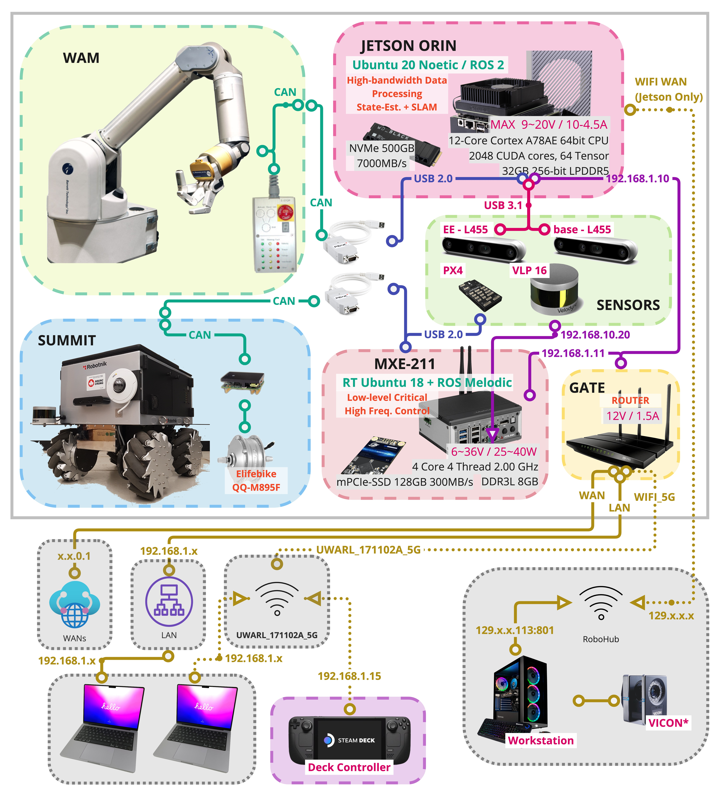

## About:
Outline and overview of works contributed by all members and alumnis from the **University of Waterloo Advanced Robotics Lab** （aka [_Waterloo Mechanical Systems & Control Lab_](https://uwaterloo.ca/waterloo-mechanical-systems-control-lab/).

- Supervisor: [Professor Soo Jeon](https://uwaterloo.ca/mechanical-mechatronics-engineering/profile/soojeon)
- People: https://uwaterloo.ca/waterloo-mechanical-systems-control-lab/our-people
- Publication: https://uwaterloo.ca/waterloo-mechanical-systems-control-lab/publications

## Wiki - Content:

  * [:diamond_shape_with_a_dot_inside: *Home*](./Home)

  * :label: **[   Lab   ]:** <--- Lab related information
    | Topics                                                       | Note                                                         |
    | ------------------------------------------------------------ | ------------------------------------------------------------ |
    | [:diamond_shape_with_a_dot_inside: *Code of Conduct*](./Lab%3ACode-of-Conduct) | Code of Conduct, with UW Academic Code of Conduct            |
    | [:diamond_shape_with_a_dot_inside: *Getting Started*](./Lab%3AGetting-Started) | :construction: ideally a manual for new comers to get started, :) |
    | [:diamond_shape_with_a_dot_inside: *List of Projects and Papers*](./Lab%3AList-of-Projects-and-Papers) | 🚧 List of Research Projcets (Incomplete List) that are public |
    | [:diamond_shape_with_a_dot_inside: *User Guide*](./Lab%3AUser-Guide) | 🚧 User Guide on GitHub                                       |
    
  * :label: **[   Logbook   ]:** <--- Log book for some of the trouble that was encountered (log and maybe **messy** :warning: , use only if encountering issues)
    
    | Logs                                                         | Note                                                         |
    | ------------------------------------------------------------ | ------------------------------------------------------------ |
    | [:diamond_shape_with_a_dot_inside: *Jetson Setup*](./Logbook%3AJetson-Setup) | Manual setup logs for Jetson Orin, includes cross-compiling Kernels (now, mostly automated) |
    | [:diamond_shape_with_a_dot_inside: *Ubuntu Setup*](./Logbook%3AUbuntu-Setup) | Ubuntu Setup (now, mostly automated)                         |
    | [:diamond_shape_with_a_dot_inside: *WAM PC Setup*](./Logbook%3AWAM-PC-Setup) | Internal / External WAM PC Manual Setup , (now, mostly automated) |
    | [:diamond_shape_with_a_dot_inside: *Waterloo Steel V2 Upgrade*](./Logbook%3AWaterloo-Steel-V2-Upgrade) | Logs on manual upgrades from V1-->V2-->V3 , V3 is managed completely by [uwarl-robot_configs](https://github.com/UW-Advanced-Robotics-Lab/uwarl-robot_configs) |
    | [:diamond_shape_with_a_dot_inside: *ZED Camera Setup*](./Logbook%3AZED-Camera-Setup) | Zed related issues, including hardware repair                |
    
  * :label: **[   Tips   ]:** <--- A guide/tip that helps YOU to guide you when you are lost
    | Tips                                                         | Note                                                         |
    | ------------------------------------------------------------ | ------------------------------------------------------------ |
    | [:diamond_shape_with_a_dot_inside: *Better Research*](./Tips%3ABetter-Research) | Tips and setups related to efficient research                |
    | [:diamond_shape_with_a_dot_inside: *Coding Guidelines*](./Tips%3ACoding-Guidelines) | General Guides: Github, Git, Documentation, Python           |
    | [:diamond_shape_with_a_dot_inside: *Dev Tools*](./Tips%3ADev-Tools) | Development Tools: Git, Linux, VM, ... (incomplete), besides our semi-automated [uwarl-robot_configs](https://github.com/UW-Advanced-Robotics-Lab/uwarl-robot_configs) packages |

  * :label: **[   Waterloo Steel   ]:** <--- :star2: The VIP (Very Important Pages) related to our hardware and development platform (Concised and actively maintained)
    | Directory                                                    | Note                                                         |
    | ------------------------------------------------------------ | ------------------------------------------------------------ |
    | [:diamond_shape_with_a_dot_inside: *Platform Instruction*](./Waterloo-Steel%3APlatform-Instruction) | :cheese: Platform Instructions: Powering, Launching, Networking, ROS, Development, Troubleshoots |
    | [:diamond_shape_with_a_dot_inside: *Platform Launch Demos*](./Waterloo-Steel%3APlatform-Launch-Demos) | :rocket: Platform Launch Demos: Demos launching instructions |
    | [:diamond_shape_with_a_dot_inside: *Platform Setup Hardware*](./Waterloo-Steel%3APlatform-Setup-Hardware) | :robot: Platform Setup for Robot Hardware: MXE 211, Jetson Orin, Steam Deck, Common in Linux with  [uwarl-robot_configs](https://github.com/UW-Advanced-Robotics-Lab/uwarl-robot_configs) |
    | [:diamond_shape_with_a_dot_inside: *Platform Setup Workstation*](./Waterloo-Steel%3APlatform-Setup-Workstation) | :computer: HOW TO SETUP YOUR LAPTOP Linux / Linux VM (Ubuntu 18/20 , melodic / noetic) with  [uwarl-robot_configs](https://github.com/UW-Advanced-Robotics-Lab/uwarl-robot_configs) |
    | [:diamond_shape_with_a_dot_inside: *Spec Hardware*](./Waterloo-Steel%3ASpec-Hardware) | :gear: Hardware specifications                               |
    | [:diamond_shape_with_a_dot_inside: *Spec Links*](./Waterloo-Steel%3ASpec-Links) | :link: Other commonly used links related to hardware specs   |

    

## Hardware System Architecture

</img>

| [Clicke Here to Download PDF Version](https://github.com/UW-Advanced-Robotics-Lab/lab-wiki/tree/main/PDF/Overall_Hardware_Architecture_Rev_3-1_2023-06-01.pdf) |
| :----------------------------------------------------------: |

## Demo Videos:

- [April 2022 | Multi-floor Operation Using The Elevator](https://www.youtube.com/watch?v=rkKu2eE83Ss)

