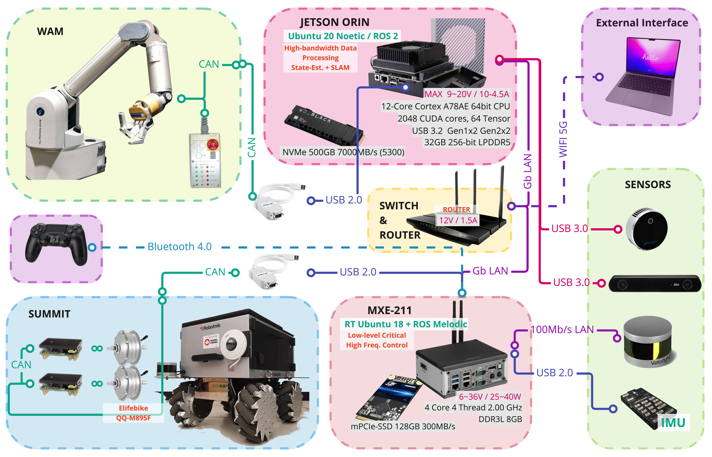

## About:
Outline and overview of works contributed by all members and alumnis from the **University of Waterloo Advanced Robotics Lab** （aka [_Waterloo Mechanical Systems & Control Lab_](https://uwaterloo.ca/waterloo-mechanical-systems-control-lab/).

- Supervisor: [Professor Soo Jeon](https://uwaterloo.ca/mechanical-mechatronics-engineering/profile/soojeon)
- People: https://uwaterloo.ca/waterloo-mechanical-systems-control-lab/our-people
- Publication: https://uwaterloo.ca/waterloo-mechanical-systems-control-lab/publications

## Hardware System Architecture
</img>

| [Clicke Here to Download PDF Version](resources/Hardware_Architecture_v2_final_(high-res).pdf) |
| :----------------------------------------------------------: |

## Demo Videos:

- [April 2022 | Multi-floor Operation Using The Elevator](https://www.youtube.com/watch?v=rkKu2eE83Ss)

