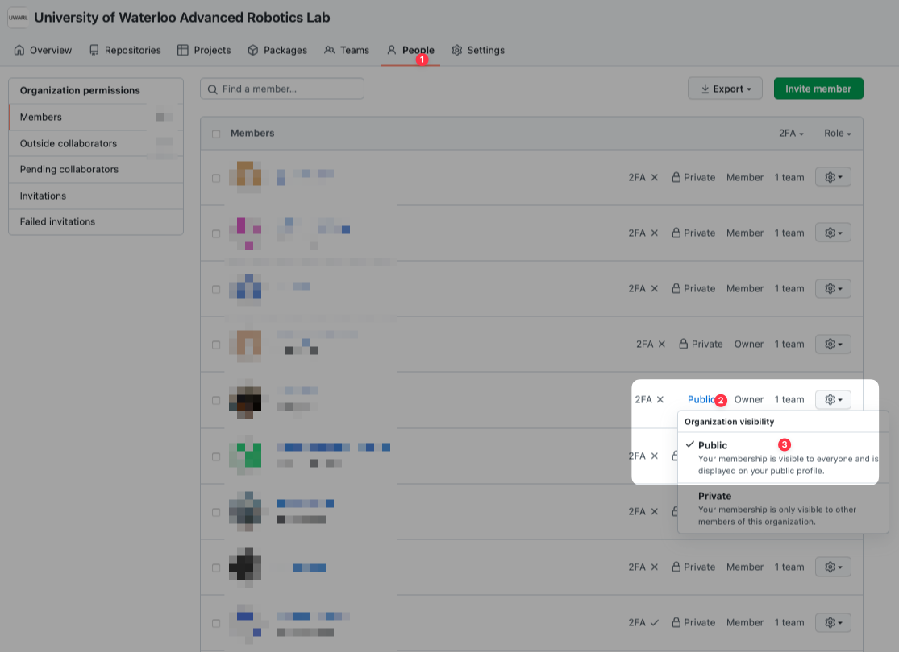
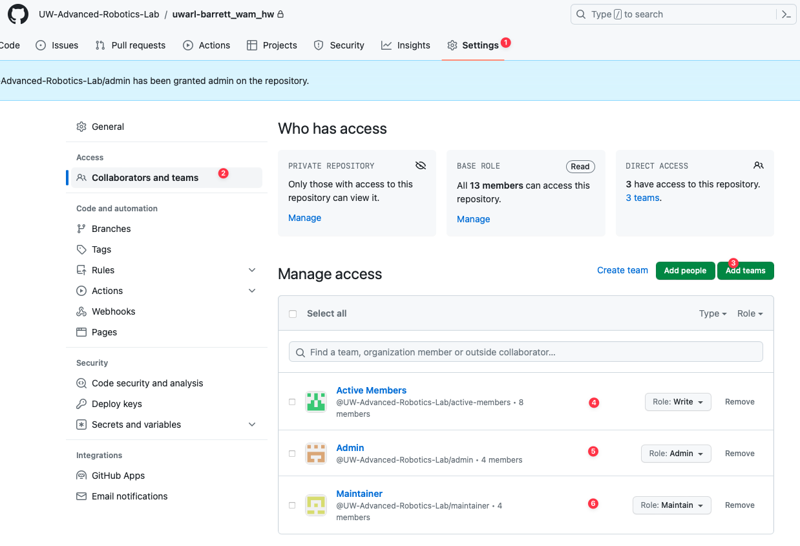

<toc>

# Table of Contents
[*Last generated: Tue 26 Sep 2023 17:45:11 EDT*]
- [**1. Lab GitHub Usage**](#1-Lab-GitHub-Usage)
  - [1.1. Make your profile visible to public:](#11-Make-your-profile-visible-to-public)
- [**2. Lab Maintainance**](#2-Lab-Maintainance)
  - [2.1 Managing Teams](#21-Managing-Teams)
    - [2.1.1 How to add access for repository:](#211-How-to-add-access-for-repository)
    - [2.1.2 How to set global moderator settings:](#212-How-to-set-global-moderator-settings)
    - [2.1.3 How to grant Owner Settings](#213-How-to-grant-Owner-Settings)

---
</toc>

# 1. Lab GitHub Usage

## 1.1. Make your profile visible to public:

- Official Instruction Reference: https://docs.github.com/en/account-and-profile/setting-up-and-managing-your-personal-account-on-github/managing-your-membership-in-organizations/publicizing-or-hiding-organization-membership

  

# 2. Lab Maintainance

## 2.1 Managing Teams

### 2.1.1 How to add access for repository:

- Default: Read
  - Read + Clone + PR + Issues
- Active Member: Write
  - Push
- Maintainer: Maintain
  - Repository Settings
- Admin: Admin
  - Deletion of the repository + add collaborators
- Creator: Admin
  - by default, you create, you are in charge of.

### 2.1.2 How to set global moderator settings:

- Moderators Settings [Admin Only]:
  - **Settings/Moderation/Moderators**: + Admin Team

### 2.1.3 How to grant Owner Settings

- change role to **Owner**
  - able to manage the Lab GitHub and add people to the team

<eof>

---
[*> Back To Top <*](#Table-of-Contents)
</eof>