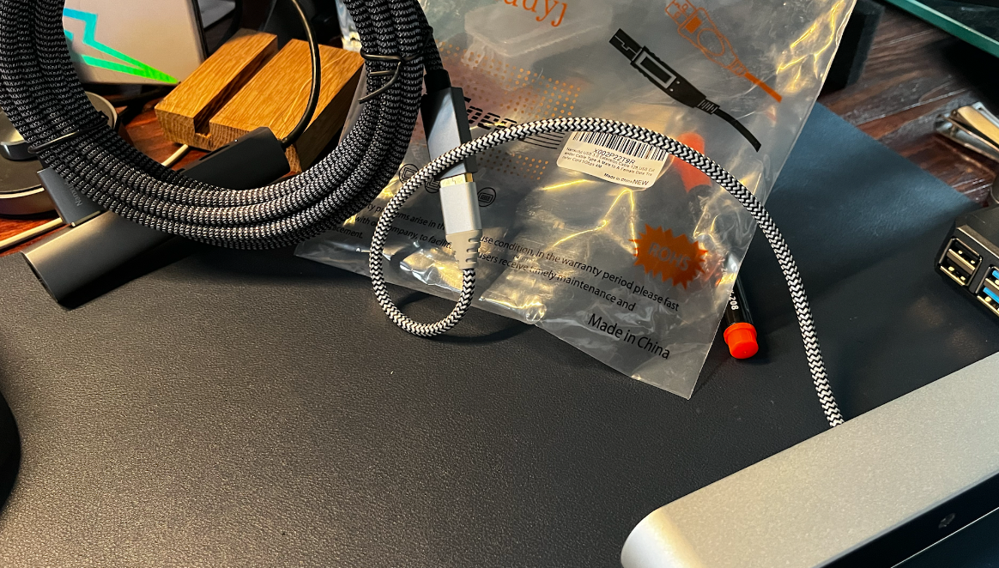

<toc>

# Table of Contents
[*Last generated: Fri  6 Jan 2023 22:35:56 EST*]
- [**ZED Camera Documentation**](#ZED-Camera-Documentation)
  - [How to fix ZED Camera USB 3.0 not recognized](#How-to-fix-ZED-Camera-USB-30-not-recognized)
    - [Replace the cable:](#Replace-the-cable)
  - [ZED SDK on Jetson ORIN](#ZED-SDK-on-Jetson-ORIN)

---
</toc>

# ZED Camera Documentation
## How to fix ZED Camera USB 3.0 not recognized
- It could be caused by the damage to the cable or loosen connector inside the camera, and need a replacement.
- Checking if it is only detecting as USB 2:
  - `lsusb -t` to see the USB devices, and make sure ZED is visible on USB 3.0 Channel with `: ZED, 5Gb/s`
  - If there are only two `480Mb/s` for left and right web cameras, this indicates a potentially faulty USB cable.
  - Try to wiggle around the cable at the ZED camera to find a sweet spot where it will be detected as USB 3.0
  - If the sweet spot does not exist, meaning that you may have to proceed to replace the cable, if the camera is out of warranty.

### Replace the cable:
:warning: |  This procedure is irreversible, and please make sure you have used all resources possible. 
:---: | :---

:information_source: |  Use a masking tape to cover the front-panel to mark the drilling positions, and drill with drill bits in an incremental diameter to the desired diameter. The tape will minimize rough cut and reduce unwanted scratches.
:---: | :---

1. Follow the tutorial from https://www.instructables.com/ZED-Disassembly/
2. Pull out the old cable carefully: 

    
3. Modify a stock USB Micro B Cable to expose the connector only (into a low-profile) 

    
4. Re-assemble the ZED camera: 

    


## ZED SDK on Jetson ORIN

1. Install ZED SDK:  https://www.stereolabs.com/developers/release/

```bash
$ cd ~/JX_Linux
$ wget https://download.stereolabs.com/zedsdk/3.8/l4t35.1/jetsons
$ mv jetsons ZED_SDK_Tegra_L4T35.1_v3.8.2.zstd.run
$ sudo apt install zstd 
$ sudo chmod +x ZED_SDK_Tegra_L4T35.1_v3.8.2.zstd.run
$ ./ZED_SDK_Tegra_L4T35.1_v3.8.2.zstd.run
```


<eof>

---
[*> Back To Top <*](#Table-of-Contents)
</eof>