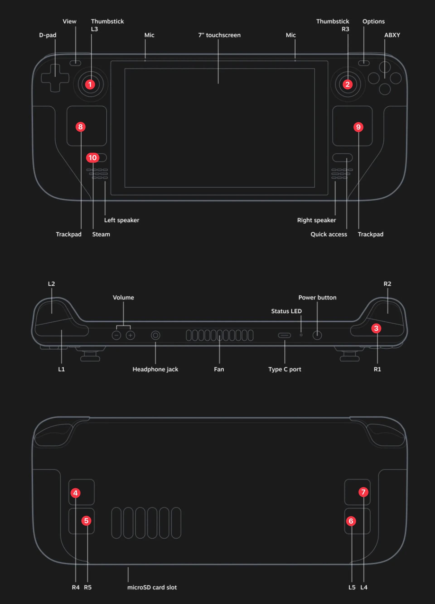

<toc>

# Table of Contents
[*Last generated: Wed  4 Oct 2023 12:55:22 EDT*]
- [**1. Waterloo Steel Demo**](#1-Waterloo-Steel-Demo)
  - [1.1 Powering on the robot](#11-Powering-on-the-robot)
  - [1.2 Launching the Camera](#12-Launching-the-Camera)
  - [1.3 Launching WAM](#13-Launching-WAM)
  - [1.4 Launching Demo Node](#14-Launching-Demo-Node)
  - [1.5 Check Demo Rosbag Records:](#15-Check-Demo-Rosbag-Records)
- [**2. Power Off**](#2-Power-Off)
  - [2.1 Power off Robot Sequence ‼️](#21-Power-off-Robot-Sequence-)
- [**A. Troubleshoot**](#A-Troubleshoot)
  - [A.1 Deck Controller Cannot Launch:](#A1-Deck-Controller-Cannot-Launch)
  - [A.2 ROS Testing](#A2-ROS-Testing)
- [**B. Hardware Guide**](#B-Hardware-Guide)
  - [B.1 Steam Deck Controller Button Layout](#B1-Steam-Deck-Controller-Button-Layout)
    - [B.1.a) Move Summit:](#B1a-Move-Summit)
    - [B.1.b) Steam Arch Linux:](#B1b-Steam-Arch-Linux)

---
</toc>


# 1. Waterloo Steel Demo

## 1.1 Powering on the robot

1. Turn on the robot by twisting two power knobs for **Base and WAM**
2. Power on the steam deck controller
3. Launch the joystick controller by touching **[Launch UWARL Summit Controller]** App Icon

   - 🚨 If the controller app quits after launching,  [[A.1 Deck Controller Cannot Launch:](#A1-Deck-Controller-Cannot-Launch)]
   - :notebook: You may launch the rviz by touching **[Launch Rviz]** App Icon

## 1.2 Launching the Camera

```bash
$ ssh uwarl-orin@192.168.1.10
$ roslaunch waterloo_steel_supervisor multi_intel_camera.launch
```

> 🚨 If the launch is not successful:
>
> 1. Check the hardware USB C cable connections to both cameras
> 2. [Ask Jack if you need to] Launch individual cameras separately for the system to register individual camera IDs

## 1.3 Launching WAM

```bash
# 1. connect to jetson
$ ssh uwarl-orin@192.168.1.10
# 2. start a tmux session
$ tmux 
### TIPS:
# create multiple windows with:
# [ctrl + b] then ["] : split horizontal
# [ctrl + b] then [%] : split vertical
# [ctrl + b] then [arrow-keys] : switch window selection
# [ctrl + b] then [:] and [type: set mouse on] : to enable mouse selection and scroll and window adjustment

# 3. launch wam node:
$ roslaunch wam_node wam_node.launch
### WAM Activation Instruction:
# 1. release all E-stops
# 2. [shift & activate] on control pendant (the one with E-stop inside the cabinet)
# 3. [Enter] on the keyboard to confirm default home-position
# Now, you will hear the gear activating

### TIPS:
# launch other nodes: 1.2 camera & 1.4 demo node in different tmux windows

# 4. detach to keep running in background and independent from your laptop terminal:
# [ctrl + b] then [:] and [type: dettach]
```

## 1.4 Launching Demo Node

```bash
$ roslaunch waterloo_steel_supervisor waterloo_steel_demo.launch
# command to perform demo:
$ rosservice call /waterloo_steel/start_demo "demo_id: 2"
```

## 1.5 Check Demo Rosbag Records:

```bash
$ ls ~/.ros/bagfiles/waterloo_steel_demo/session_{id}/
```

# 2. Power Off

## 2.1 Power off Robot Sequence ‼️ 

> :warning: If possible, ssh into the jetson and summit PC to shutdown the PC first
>
> ```bash
> # jetson:
> $ ssh uwarl-orin@192.168.1.10
> # summit:
> $ ssh ssh uwarl@192.168.1.11
> ```

1. Long Press Green Button to power off the **Jetson PC**
2. Turn off the **WAM** power rails 
3. Turn off the **overall power rails** 
4. Turn off the screen of the steam deck by pressing power button briefly once, and put into charger.
   - we dont want a reboot of steam deck

# A. Troubleshoot

## A.1 Deck Controller Cannot Launch:

🚨 If the controller app quit after launching, it is likely due to the following issues:

 1.  The deck is not connected to summit wifi "*SUMMIT_STEEL_171102A_5G*"

     > 🛠️ Connect to the wifi manually at the status bar

 2.  The summit is not hardware ready:

     > 🛠️ Please reset (engage and release) the E-Stop at the rear of the SUMMIT base

 3.  There is no ros core in the network OR any other detailed issues → The Summit Base ROS Controller and ROS Core were not launched successfully nor enabled:

     > 🛠️ Please SSH into the summit base and troubleshoot from there:
     >
     > ```bash
     > # SSH into adlink mxe211 (summit)
     > $ ssh uwarl@192.168.1.11
     > 
     > # check if summit bringup is successful
     > $ systemctl status --user roscorelaunch@waterloo_steel_summit_bringup:waterloo_steel_summit.launch
     > 
     > # [DEBUG] - print out last msg (double-check time-stamp):
     > $ journalctl --follow --user --user-unit=roscorelaunch@waterloo_steel_summit_bringup:waterloo_steel_summit.launch.service > log.txt
     > # [DEBUG] - Live Stream:
     > $ journalctl --follow --user --user-unit=roscorelaunch@waterloo_steel_summit_bringup:waterloo_steel_summit.launch.service
     > 
     > # stop/restart
     > $ systemctl stop --user roscorelaunch@waterloo_steel_summit_bringup:waterloo_steel_summit.launch
     > $ systemctl restart --user roscorelaunch@waterloo_steel_summit_bringup:waterloo_steel_summit.launch
     > 
     > # You may want to check if the workspace is at the right target, and built successfully:
     > $ check_ws_status
     > $ build_ws
     > $ src_all
     > ```


## A.2 ROS Testing

```bash
$ rosnode ping -c 4 rosout
rosnode: node is [/rosout]
pinging /rosout with a timeout of 3.0s
xmlrpc reply from http://ann:46635/     time=1.195908ms
xmlrpc reply from http://ann:46635/     time=1.123905ms
xmlrpc reply from http://ann:46635/     time=1.144886ms
xmlrpc reply from http://ann:46635/     time=1.137018ms
ping average: 1.150429ms
```

- http://wiki.ros.org/rosnode

# B. Hardware Guide

## B.1 Steam Deck Controller Button Layout



### B.1.a) Move Summit:

- Launch the joystick controller by touching **[Launch UWARL Summit Controller]** App Icon

- Button Layouts:
  - Hold :three: **[R1]**  + Move Up/Down :one: **[L3]** : Forward/Reverse
  - Hold :three: **[R1]**  + Move Left/Right :two: **[R3]** : CCW/CW
  - Hold :three: **[R1]**  + Press **(11)** **[Options]** : Omni / Skid Mode

### B.1.b) Steam Arch Linux:

- :four: **[R4]** : Scroll Up
- :five: **[R5]** : Scroll Down
- :six: **[L5]** : Left Mouse Click for Mouse Menus
- :seven: **[L4]** : Enter 
- :eight: **[Left Trackpad]**  Button Click : Arrow Key Up/Down/Left/Right
- 9️⃣ **[Right Trackpad]** : Mouse Move +  Mouse Right Click
- :keycap_ten: **[Steam]** : Menu Selection ---> Used to switch between Steam OS / ArchLinux Mode + Power/Restart


<eof>

---
[*> Back To Top <*](#Table-of-Contents)
</eof>