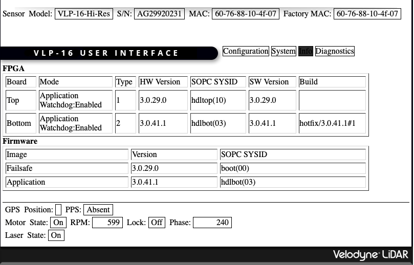
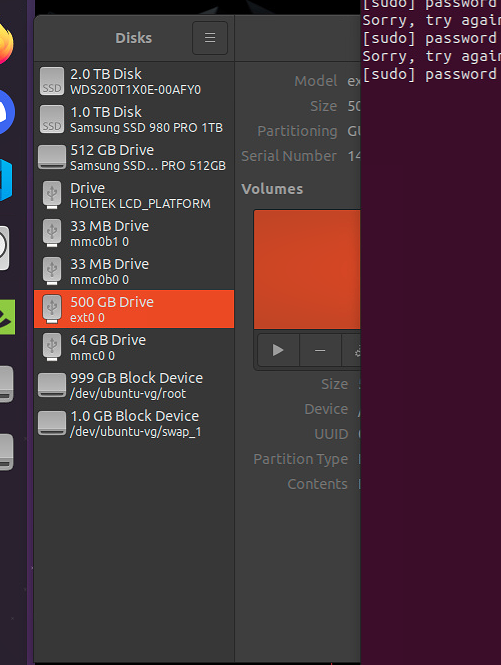
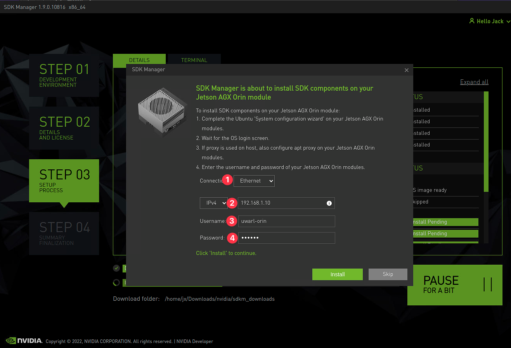

<toc>

# Table of Contents
[*Last generated: Wed 14 Dec 2022 19:52:01 EST*]
- [**0. Common**](#0-Common)
  - [0.1 Remote Screen:](#01-Remote-Screen)
    - [0.1.1 XRDP SSH --> Adlink](#011-XRDP-SSH-Adlink)
    - [0.1.2 :no_entry_sign: VNC](#012-no_entry_sign-VNC)
    - [0.1.3 :star: NO MACHINE --> Jetson Orin (for GPU acc)](#013-star-NO-MACHINE-Jetson-Orin-for-GPU-acc)
  - [0.2 SSH Keys and Github](#02-SSH-Keys-and-Github)
  - [0.3 Commonly used command:](#03-Commonly-used-command)
  - [0.4 ZSH & oh-my-zsh](#04-ZSH-oh-my-zsh)
  - [0.5 TMUX: virtual terminal within terminal](#05-TMUX-virtual-terminal-within-terminal)
  - [0.6 VIM:](#06-VIM)
  - [0.7 Useful Apt Tools:](#07-Useful-Apt-Tools)
    - [0.7.1 tree - file directory print](#071-tree-file-directory-print)
    - [0.6.2 zenith - system activity monitor in terminal](#062-zenith-system-activity-monitor-in-terminal)
  - [0.7 ROS Tools:](#07-ROS-Tools)
    - [0.7.1 Rviz:](#071-Rviz)
- [**1. Adlink MXE 211 (Robotnik SUMMIT PC)**](#1-Adlink-MXE-211-Robotnik-SUMMIT-PC)
  - [1.1 RT Kernel](#11-RT-Kernel)
  - [1.2  Peak Linux Driver](#12-Peak-Linux-Driver)
  - [1.3 Install ROS:](#13-Install-ROS)
  - [1.4 [:star:] UWARL ROS Catkin Workspace Setup](#14-star-UWARL-ROS-Catkin-Workspace-Setup)
    - [1.4.1 ⭐ [Automated] Install Catkin Workspace + Hardware Setup](#141-Automated-Install-Catkin-Workspace-Hardware-Setup)
      - [1.4.1-(3) How to Build Hardware Package?](#141-3-How-to-Build-Hardware-Package)
    - [1.4.2 Setup Auto-launch at the boot:](#142-Setup-Auto-launch-at-the-boot)
      - [1.4.2.1 How to use/stop/log auto-launch](#1421-How-to-usestoplog-auto-launch)
  - [1.5 Sony PS PAD Controller](#15-Sony-PS-PAD-Controller)
  - [1.6 Pixhawk PX4 Flight Controller - Chassis IMU](#16-Pixhawk-PX4-Flight-Controller-Chassis-IMU)
  - [1.7 Velodyn (VLP 16)](#17-Velodyn-VLP-16)
  - [1.8 (Optional) Switching Adlink as WAM PC:](#18-Optional-Switching-Adlink-as-WAM-PC)
- [**2. Jetson Orin (Barrett WAM External PC)**](#2-Jetson-Orin-Barrett-WAM-External-PC)
  - [2.0 Flash Linux OS & Install JetPack :v:](#20-Flash-Linux-OS-Install-JetPack-v)
    - [2.0.a eMMC SD](#20a-eMMC-SD)
    - [2.0.b NVMe SSD](#20b-NVMe-SSD)
      - [2.0.b.0 Wipe NVMe SSD](#20b0-Wipe-NVMe-SSD)
      - [2.0.b.1 Flash Linux onto NVMe direct Boot:](#20b1-Flash-Linux-onto-NVMe-direct-Boot)
      - [2.0.b.2 Install Jetpack SDK with SDK Manager:](#20b2-Install-Jetpack-SDK-with-SDK-Manager)
  - [2.1 [Optional*] (Jetson) RT Kernel :yum:](#21-Optional-Jetson-RT-Kernel-yum)
    - [2.1.1 Build custom kernel from source:](#211-Build-custom-kernel-from-source)
      - [2.1.1.(A) Build on Host PC:](#211A-Build-on-Host-PC)
      - [2.1.1.(B) Build Locally on Jetson:](#211B-Build-Locally-on-Jetson)
    - [2.1.2 Apply kernel to the boot:](#212-Apply-kernel-to-the-boot)
  - [2.2 [:wrench: if Manual] Peak Linux Driver  (Out-of-tree Linux RT Header)](#22-wrench-if-Manual-Peak-Linux-Driver-Out-of-tree-Linux-RT-Header)
  - [2.3 [:wrench: if Manual] Install ROS](#23-wrench-if-Manual-Install-ROS)
    - [[TODO-fix] Configure ROS Environment:](#TODO-fix-Configure-ROS-Environment)
  - [2.5 [:wrench: If Manual] How to Build Libbarrett Hardware Library?](#25-wrench-If-Manual-How-to-Build-Libbarrett-Hardware-Library)
  - [2.4 [:star: automated] UWARL ROS Catkin Workspace Setup](#24-star-automated-UWARL-ROS-Catkin-Workspace-Setup)
  - [2.5 ZED Stereo-Camera](#25-ZED-Stereo-Camera)
  - [2.6 Intel i515 Lidar Mono-Camera](#26-Intel-i515-Lidar-Mono-Camera)
    - [2.6.1 Install:](#261-Install)
    - [2.6.2: ROS Launch Multi Cameras](#262-ROS-Launch-Multi-Cameras)


</toc>

---

> :notebook: This cleanup is based on Logbook on V2 Upgrade, and semi-automated with our [uwarl-robot_configs](https://github.com/UW-Advanced-Robotics-Lab/uwarl-robot_configs) packages. So you do not have to troubleshoot much.

# 0. Common

> Highly recommended to install the items below ! 

## 0.1 Remote Screen:

### 0.1.1 XRDP SSH --> Adlink

```bash
$ ./uwarl-robot_configs/scripts/auto-install_xrdp_screen.sh
```

> :rotating_light: Xfce is lighter, GNOME is quite heavy, not recommended for remote screen via ssh.
>
> :information_source: Ref: XFCE XRDP: https://www.hiroom2.com/ubuntu-2004-xrdp-xfce-en/
>
> :warning: No rviz, as it requires display and gpu acc, xrdp is just a network access

### 0.1.2 :no_entry_sign: VNC

> ref: https://www.oliverjobson.co.uk/technology/set-up-vnc-with-a-ubuntu-server-and-mac-client-simple-ssh-tunnel/

1. Install on Jetson:

   ```bash
   $ sudo apt-get install x11vnc
   # set pwd:
   $ x11vnc -storepasswd
   # start hosting:
   $ x11vnc -forever -bg -usepw -httpdir /usr/share/vnc-java/ -httpport 5901 -display :1
   $ x11vnc -forever -bg -usepw -httpdir /usr/share/vnc-java/ -httpport 5577 -display :1
   # Kill:
   sudo pgrep x11vnc
   # [OUTPUT]: 1234 //process ID returned from the command, then: 
   kill 1234
   ```

2. SSH over from Mac:

   ```bash
   $ ssh uwarl-orin@192.168.1.10 -L 5900:localhost:5900
   ```

3. Connect:

   1. Click Desktop
   2. [ CMD + K ]
   3. Enter: `vnc://localhost`

4. **without monitor <--- not possible???/ :sweat:**

   Attemps:

   ```bash
   # command:
   mkdir -p ~/.config/autostart
   cp /usr/share/applications/vino-server.desktop ~/.config/autostart/.
   
   cd /usr/lib/systemd/user/graphical-session.target.wants
   sudo ln -s ../vino-server.service ./.
   gsettings set org.gnome.Vino prompt-enabled false
   gsettings set org.gnome.Vino require-encryption false 
   gsettings set org.gnome.Vino authentication-methods "['vnc']"
   gsettings set org.gnome.Vino vnc-password $(echo -n 'arlarl'|base64)
   
   
   # modify:
   $ sudo vim /etc/X11/xorg.conf
   # add with:
   Section "Screen"
      Identifier    "Default Screen"
      Monitor       "Configured Monitor"
      Device        "Tegra0"
      SubSection "Display"
          Depth    24
          Virtual 1280 800 # Modify the resolution by editing these values
      EndSubSection
   EndSection
   ```

   - ref: https://forums.developer.nvidia.com/t/jetson-orin-no-monitor-vnc-only-splash-screen-until-monitor-connected/220642/6

   - https://en.wikipedia.org/wiki/Xvfb

     ```bash
     sudo apt install xvfb
     
     export DISPLAY=:1
     Xvfb "$DISPLAY" -screen 0 1024x768x24 &
     fluxbox &
     x11vnc -display "$DISPLAY" -bg -nopw -listen localhost -xkb
     
     
     ssh -N -T -L 5900:localhost:5900 uwarl-orin@192.168.1.10 &
      vncviewer -encodings 'copyrect tight zrle hextile' localhost:5900
     ```

### 0.1.3 :star: NO MACHINE --> Jetson Orin (for GPU acc)

- Available: Android, IOS, Linux, Mac, Win

  - Fast and efficient and more secure than VNC, lighter than xrdp

  - Virtual display , so you can run rviz without monitor

  - > :notes: Since Jetson has GPU and is the main computing unit with visions, some modules require a display installed when testing and running rviz within the network. Now, it is possible with NO Machine. 

- NO Machine: https://downloads.nomachine.com

  - [Jetson Orin] ARMv8 aarch64:

    ```bash
    # dummy display driver {needed for display acc}:
    $ sudo apt-get install xserver-xorg-video-dummy -y 
    # add fake:
    $ sudo vim /etc/X11/xorg.conf
    # add with:
    Section "Device"
        Identifier  "Configured Video Device"
        Driver      "dummy"
    EndSection
    Section "Monitor"
        Identifier  "Configured Monitor"
        HorizSync 31.5-48.5
        VertRefresh 50-70
    EndSection
    Section "Screen"
        Identifier  "Default Screen"
        Monitor     "Configured Monitor"
        Device      "Configured Video Device"
        DefaultDepth 24
        SubSection "Display"
        Depth 24
        Modes "1920x1080"
        EndSubSection
    EndSection
    # NO Machine URDC:
    $ cd ~/JX_Linux
    $ wget https://download.nomachine.com/download/8.2/Arm/nomachine_8.2.3_3_arm64.deb
    $ sudo dpkg -i nomachine_8.2.3_3_arm64.deb
    ```

  - [Mac/WIN] PC:

    - Download NoMachine and open it, it will show any NoMachine available in the WLAN network

## 0.2 SSH Keys and Github

1. generate key `ssh-keygen -t ed25519 -C "your_email@example.com"`
2. copy the public key  `cat ~/.ssh/id_ed25519.pub`
3. paste to GitHub SSH keys under personal account profile

## 0.3 Commonly used command:

1. `$ uname -r`: OS check 
2. `$ cat /prov/version_signature`: identify kernel
3. `$ arp -a` : Scan Local Network Devices and IPs
4. `$ tree -L 1`: list hierarchy of directory in depth=1,may  require: `sudo apt install tree`

## 0.4 ZSH & oh-my-zsh

- install zsh first 

  ```bash
  $ sudo apt install zsh
  ```

- **Oh-my-zsh** (THE hipster dev tool + coke)

  ```bash
  $ sudo apt install curl
  $ sh -c "$(curl -fsSL https://raw.githubusercontent.com/ohmyzsh/ohmyzsh/master/tools/install.sh)"
  
  # to modify themes:
  $ sudo vim ~/.zshrc
  ## Recommended themes: `ys` and `jonathan`
  $ source ~/.zshrc
  ```
  
  > :information_source:  https://github.com/ohmyzsh/ohmyzsh
  >
  > :information_source: Themes: https://github.com/ohmyzsh/ohmyzsh/wiki/Themes

## 0.5 TMUX: virtual terminal within terminal

- https://linuxize.com/post/getting-started-with-tmux/
- Pretty/Easy-to-use Custom Mod: https://www.hamvocke.com/blog/a-guide-to-customizing-your-tmux-conf/ (except ctrl-b mod)

> :notebook: Do not use multiple `ssh` clients, as they will make the system a bit heavier. 

> 🔥 Tmux can still run in the background, even if the computer is disconnected from the internet. 

> :warning: Normal ssh sessions without tmux will terminate the program if your ssh client is disconnected

## 0.6 VIM:

1. set github editor to vim:

   ```bash
   $ git config --global core.editor "vim"
   ```

   > or have env variable in zshrc: `export GIT_EDITOR=vim`

2. Why VIM? ---> personal preference

## 0.7 Useful Apt Tools:

### 0.7.1 tree - file directory print

```bash
$ sudo apt install tree
$ tree -L 2

# Example outputs:
.
├── README.md
├── scripts
│   ├── auto-config_UWARL_catkin_ws.zsh
│   ├── common.sh
│   ├── git_functions.sh
│   └── shortcuts.sh
├── summit
│   ├── install_geographiclib_datasets.sh
│   ├── rgbd_summit.rviz
│   ├── ros-melodic-robotnik-msgs_2.2.0-0bionic_amd64.deb
│   ├── summitxl_params.env
│   ├── summitxl_ros_config.bash
│   ├── summitxl_ros_config.zsh
│   └── user_services
└── wam
    └── barrett.zip
```

### 0.6.2 zenith - system activity monitor in terminal

- Refer to https://github.com/bvaisvil/zenith


## 0.7 ROS Tools:

### 0.7.1 Rviz:

```bash
$ sudo apt-get install ros-noetic-rviz

# workaround for no display and qt error
export QT_QPA_PLATFORM=offscreen 
$ rosrun rviz rviz
```


# 1. Adlink MXE 211 (Robotnik SUMMIT PC)

| Ubuntu 18.04 - RT | Intel(R) Atom(TM) Processor E3950 @ 1.60GHz - 4 Cores - x64_86 | ROS-Melodic | NOT_NETDEV PCAN | 8 GB | 25W-35.2W |
| ----------------- | ------------------------------------------------------------ | ----------- | --------------- | ---- | --------- |

## 1.1 RT Kernel

- RT kernel patch: https://stackoverflow.com/questions/51669724/install-rt-linux-patch-for-ubuntu

  > [INSERT-HERE] Should be self-explanatory, good luck, and maybe log your steps as well.

## 1.2  Peak Linux Driver

> :information_source: If needed, refer [Linux User Manual](https://www.peak-system.com/fileadmin/media/linux/files/PCAN-Driver-Linux_UserMan_eng.pdf)

1. Download Peak Driver:

   ```bash
   #download:
   $ wget https://www.peak-system.com/fileadmin/media/linux/files/peak-linux-driver-8.15.2.tar.gz
   #untar:
   $ tar -xzf peak-linux-driver-8.15.2.tar.gz
   ```

2. Build driver:

   ```bash
   $ cd peak-linux-driver-8.15.2.tar.gz
   $ sudo make clean
   $ sudo make
   ```

3. Install driver:

   1. **NO NETDEV** with default peak-linux-driver make file

      > :warning: with netdev, it wont work for summit controller `make ` , but  WAM requires netdev `make -C driver NET=NETDEV_SUPPORT`

      ```bash
      $ sudo make install
      ```

   2. (**Optional**) Configure PC CAN interfaces `$ cat /etc/modprobe.d/pcan.conf`:

      ```bash
      #### Below is the configuration found from summit-PC: ###
      # pcan - automatic made entry, begin --------
      # if required add options and remove comment 
      # options pcan type=isa,sp
      install pcan modprobe --ignore-install pcan
      # pcan - automatic made entry, end ----------
      ```

   3. loading driver:

      ```bash
      $ sudo modprobe pcan
      
      # check if it's loaded properly:
      $ sudo dmesg | grep pcan
      ```

      > 🟠 If dmseg failed: operation note permitted. ----> unlock restriction from non-root 
      >
      > ```bash
      > $ sudo sysctl kernel.dmesg_restrict=0
      > ```
      >
      > If it still does not work, reboot. Else, troubleshooting is needed. 

   4. check PCAN-USB is configured properly

      ```bash
      $ cat /proc/pcan
      
      *------------- PEAK-System CAN interfaces (www.peak-system.com) -------------
      *------------- Release_20180720_n (8.6.0) May 25 2021 11:16:42 --------------
      *------------- [mod] [isa] [pci] [pec] [dng] [par] [usb] [pcc] --------------
      *--------------------- 1 interfaces @ major 243 found -----------------------
      *n -type- -ndev- --base-- irq --btr- --read-- --write- --irqs-- -errors- status
      32    usb   -NA- ffffffff 000 0x001c 00000000 00000000 00000000 00000000 0x0000
      ```

4. setup `60-can.rules` for robotnik summit CAN controller 

   1. ```bash
      $ sudo vim /etc/udev/rules.d/60-can.rules
      # add a line:
      KERNEL=="pcanusb*", SYMLINK+="pcan_base", MODE="0666"
      ```

      > Delete this "pcanusb" for WAM mode driver can0
   
5. Reload udev rules or reboot to take effect:

   ```bash
   $ sudo service udev reload
   $ sudo service udev restart
   $ sudo udevadm trigger
   $ sudo rmmod pcan
   $ sudo modprobe pcan
   ```

6. Connect Peak USB-CAN dongle, and validate:

   ```bash
   $ sudo dmesg | grep pcan
   $ ls /dev/pcanusb*
   ```

> :triangular_flag_on_post:  **[TODO]** May be worth it to backup udev rules and scripts into uwarl-robot_configs. 


## 1.3 Install ROS:


## 1.4 [:star:] UWARL ROS Catkin Workspace Setup

### 1.4.1 ⭐ [Automated] Install Catkin Workspace + Hardware Setup

0. Pre-req:

   1. **Make sure SSH authenticated with Github, see instruction @ [0.2 SSH Keys and Github](#0.2 SSH Keys and Github)**

   2. Zsh: [0.4 ZSH & oh-my-zsh](#04-ZSH-oh-my-zsh)

1. Clone configurations: 

   ```zsh
   $ cd ~ && git clone git@github.com:UW-Advanced-Robotics-Lab/uwarl-robot_configs.git
   ```

2. Install the repo with auto-script:

   ```zsh
   $ cd ~ && ./uwarl-robot_configs/scripts/auto-config_UWARL_catkin_ws.zsh
   ```

   > :notebook: this script will install automatically based on the **user name** (e.g. uwarl-orin) to identify the PC space

3. Install Hardware Package:

   ```bash
   $ sudo dpkg -i ~/uwarl-robot_configs/summit/ros-melodic-robotnik-msgs_2.2.0-0bionic_amd64.deb
   ```

   > :warning: You may not find this one from the server directly, but I did hard work for you, as stated below:

   #### 1.4.1-(3) How to Build Hardware Package?

   > :warning: In Melodic, you will see errror on dependency `melodic-msgs`, which is not available in melodic server, and required a local build, which will be done later with catkin build, just ignore this error

   1. :notebook: we can actually build one :D

      ```bash
      $ cd UWARL_catkin_ws/uwarl-robotnik_msgs
      $ catkin build --this
      $ bloom-generate rosdebian --os-name ubuntu --ros-distro melodic
      $ fakeroot debian/rules binary
      ```

   - Build base_hw dpkg:

     ```bash
     sudo dpkg -i uwarl-robotnik_base_hw/lib/ros-melodic-robotnik-base-hw-lib_****_amd64.deb
     ```

4. Configure ROS Environment:\

   ```bash
   # (Optional) Ensure ip are correct in the env.
   $ sudo vim ~/uwarl-robot_configs/summit/user_services/environment
   # Copy ROS env:
   $ sudo cp ~/uwarl-robot_configs/summit/user_services/environment ~/.ros/
   ```

5. Catkin Build:    

   ```bash
   # source robot config env & ros
   $ source ~/.zshrc
   # build:
   $ cd $ROS_CATKIN_WS && catkin_build
   ### Trick:
   $ build_ws # from anywhere, which will does the job for you :P (Jack is too lazy)
   ```

### 1.4.2 Setup Auto-launch at the boot:

- Let's use system boot as a method to auto-boot services, as they can be restarted easily with status logs

  > This is different from what Robotnik was doing, but way better :P

- User system Permissions:

  ```bash
  $ sudo usermod -a -G dialout $USER 
  $ sudo usermod -a -G root $USER
  ```

- Create auto roslaunch:

  ```bash
  $ cd ~
  # load system services:
  #[OPTIONAL] roscore only:
  $ sudo cp uwarl-robot_configs/summit/user_services/roscore.service /usr/lib/systemd/user
  #[this one] roscore and roslaunch:
  $ sudo cp uwarl-robot_configs/summit/user_services/roscorelaunch@.service /usr/lib/systemd/user
  #[OPTIONAL] depends on remote roscore:
  $ sudo cp uwarl-robot_configs/summit/user_services/roslaunch@.service /usr/lib/systemd/user 
  
  # create launch for summit:
  $ systemctl --user daemon-reload
  $ systemctl --user enable roscorelaunch@waterloo_steel_bringup:waterloo_steel_summit.launch
  
  # uninstall:
  $ systemctl --user disable roscorelaunch@waterloo_steel_bringup:waterloo_steel_summit.launch
  
  # Start at bootup instead of graphical login
  sudo loginctl enable-linger $USER
  ```

#### 1.4.2.1 How to use/stop/log auto-launch

```bash
# check system:
$ systemctl --user status roscorelaunch@waterloo_steel_bringup:waterloo_steel_summit.launch.service

# restart:
$ systemctl --user restart roscorelaunch@waterloo_steel_bringup:waterloo_steel_summit.launch.service

# stop:
$ systemctl --user stop roscorelaunch@waterloo_steel_bringup:waterloo_steel_summit.launch.service

# check log:
$ journalctl --user --user-unit=roscorelaunch@waterloo_steel_bringup:waterloo_steel_summit.launch.service
# live:
$ journalctl --follow --user --user-unit=roscorelaunch@waterloo_steel_bringup:waterloo_steel_summit.launch.service
```

## 1.5 Sony PS PAD Controller

> :information_source: You may want to prepare the ROS first as instructed in [1.8 [:star:] UWARL ROS Catkin Workspace Setup](#18-star-UWARL-ROS-Catkin-Workspace-Setup)

- https://github.com/RobotnikAutomation/robotnik_pad

  - ds4drv automatic install: 

    ```bash
    $ sudo ./ds4drv-install.sh
    ```

    > :notebook: This step also modifies the `udev`  file: `/etc/udev/rules.d/50-ds4drv.rules`
    >
    > - Since PS4 Hidraw mode creates two jsX devices.
    >   - one by DS4DRV
    >   - one by OS upon pairing (only buttons, no acc)
    >
    > - There could be a race condition between the name of the devices, hence, we need a rules at the udev level, and prioritize js0 as the OS version, and then, js1 will be registered for ds4drv.

  - Check service:

    ```bash
    $ systemctl status ds4drv.service
    ```

  - Configuration setting: 

    ```bash
    $ sudo vim ds4drv.conf
    ```

  - [**Troubleshoots**] You may encounter:

  - >  :rotating_light: Please install `pip install six==1.13` or above, so ps4drv does not fail 

  - >  :tipping_hand_man: If not working, try `sudo` , sigh

  - > :tipping_hand_man: if systemctl cannot find package for ds4drv, make sure installed using `sudo python3.6 -m pip install -U ds4drv` instead of pip tool to be clear
    >
    > :tipping_hand_man: if does not work, try clearpath branch: https://github.com/clearpathrobotics/ds4drv

- Bluetooth dongle (**pluggable** usb bluetooth 4.0 @ usb 2.0 port):

  > :tophat: This is the magical dongle that works like magic, the one that came with Robotnik does not work well in Linux.

  - check Bluetooth socket layer init status

    ```bash
    $ dmesg | egrep -i 'blue|firm' | cut -c 16-
    ```

  - Check:

    ```bash
    $ sudo systemctl status bluetooth.service # <-- make sure it is working
    $ rfkill list
    $ hcitool dev
    ```

  - Connect:

    ```bash
    $ sudo bluetoothctl
    
    #----- Command:
    [bluetooth]# scan on
    [bluetooth]# trust MAC
    [bluetooth]# agent on
    [bluetooth]# pair MAC
    ```

  - Check if jsX live is connected:

    ```bash
    $ ls /dev/input
    ```

  - Check udev name for js0 as "Sony Entertainment ***":

    ```bash
    $ udevadm info -a /dev/input/js0
    ```


> :triangular_flag_on_post:  **[TODO]** May be worth it to backup udev rules and scripts into uwarl-robot_configs. ---Jack

## 1.6 Pixhawk PX4 Flight Controller - Chassis IMU

- PX4: https://docs.px4.io/main/en/dev_setup/building_px4.html

- ROS Guide: http://wiki.ros.org/RobotnikAutomation/Tutorials/Use%20Pixhawk%20in%20AGV

  ```bash
  $ sudo apt-get install ros-melodic-mavros ros-melodic-mavros-extras
  ```

- Steps:

  1. Identify the serial number:

     ```bash
     $ udevadm info -a /dev/ttyUSB0 | grep serial
     
     # --- Output:
         SUBSYSTEMS=="usb-serial"
         ATTRS{serial}=="FTA31EZ3"
         ATTRS{serial}=="0000:00:15.0"
     ```

  2. Create / Modify udev:

     ```bash
     $ sudo vim /etc/udev/rules.d/50-pixhawk.rules
     
     ## -- Paste Below:
     KERNEL=="ttyUSB[0-9]*", OWNER="summit", GROUP="dialout", MODE="0666"
     KERNEL=="ttyUSB[0-9]*", ATTRS{idProduct}=="6001", ATTRS{serial}=="FTA31EZ3", NAME="%k", SYMLINK="ttyUSB_PX4", GROUP="dialout", MODE="0666"
     ```

     If using USB-to-micro_USB:

     ```bash
     KERNEL=="ttyUSB[0-9]*", OWNER="summit", GROUP="dialout", MODE="0666"
     SUBSYSTEM=="tty", ATTRS{idVendor}=="26ac", ATTRS{idProduct}=="0011", NAME="%k", SYMLINK="tty_PX4", GROUP="dialout", MODE="0666"
     ```

  3. reload and restart rules:

     ```bash
     $ sudo service udev reload 
     $ sudo service udev restart 
     $ sudo udevadm trigger
     ```


> :triangular_flag_on_post:  **[TODO]** May be worth it to backup udev rules into uwarl-robot_configs. ---Jack

## 1.7 Velodyn (VLP 16)

- 

- Updated to 3.0.41 on Oct-19,2022

  - Now we have DHCP :) 

- > ⚠️ Make sure the velodyn is on different subnet with the router, else you will not be able to use wifi at all due to conflicts

- ROS: http://wiki.ros.org/velodyne/Tutorials/Getting%20Started%20with%20the%20Velodyne%20VLP16

  ```bash
  $ sudo apt-get install ros-melodic-velodyne
  # test launch
  $ roslaunch velodyne_pointcloud VLP16_points.launch	
  $ rosnode list
  $ rostopic echo /velodyne_points
  # rviz:
  $ rosrun rviz rviz -f velodyne
  ```

## 1.8 (Optional) Switching Adlink as WAM PC:

- Please refer to the instruction [Logbook:WAM-PC-Setup.md](Logbook:WAM-PC-Setup.md)

- Adlink was originally purchased as WAM External PC, but reutilized to host as a SUMMIT PC, since summit only support x86 architecture

- But you can dynamically switch the current system by 

  1. Modifying can udev rules:

     ```bash
     $ sudo vim /etc/udev/rules.d/60-can.rules
     
     # clear the file 
     # for Summit:
     KERNEL=="pcanusb*", SYMLINK+="pcan_base", MODE="0666"
     
     # for WAM:
     RUN+="/bin/reset_can.sh"
     ```

  2. re-installing NON/NETDEV-pcan driver 

     ```bash
     # NOTE: these two directories are pre-built with PCAN instruction above
     ### for switching from [Summit ---> WAM]
     # uninstall NON-NETDEV:
     $ cd ~/UWARL_drivers/peak-linux-driver-8.14.0-rt-no-ndev 
     $ sudo make uninstall
     # install NETDEV:
     $ cd ~/UWARL_drivers/peak-linux-driver-8.14.0
     $ sudo make install
     
     # reactivate:
     $ sudo modprobe pcan
     $ sudo rmmod pcan
     $ sudo reboot
     
     # check:
     $ sudo dmesg | grep pcan
     $ cat /proc/pcan
     ```

  3. swapping out the PCAN dongle


# 2. Jetson Orin (Barrett WAM External PC)

| Ubuntu 20.04 - RT - Tegra | Arm® Cortex®-A78AE v8.2 64-bit CPU 2.2GHz - 12 Cores - aarch64/arm64 | ROS-Noetic | NETDEV PCAN | 32 GB | 15~60W |
| ------------------------- | ------------------------------------------------------------ | ---------- | ----------- | ----- | ------ |

## 2.0 Flash Linux OS & Install JetPack :v:

- On Ubuntu 20.04 PC, install SDK Manager
- Install [ **JetPack 5.0.2 | Jetson Linux r35.1**] Linux For Jetson AGX Orin Modules
  - **Jetson Linux Release Doc**: https://developer.download.nvidia.com/embedded/L4T/r35_Release_v1.0/Jetson_Linux_Release_Notes_r35.1.pdf
  - **Kernel Packages**:  https://docs.nvidia.com/jetson/archives/r35.1/DeveloperGuide/text/SD/Kernel/KernelCustomization.html#using-the-jetson-linux-real-time-kernel-package
  - Getting Started: https://developer.nvidia.com/embedded/learn/get-started-jetson-agx-orin-devkit
- Boot Jetson into Flashing mode (By restarting the hardware, while holding the other two buttons to enter the recovering mode.)

### 2.0.a eMMC SD 

-  Just use manual flashing mode with pre-configure:

  ```
  account: uwarl-orin
  password: xxxxxx
  ```

- If you are going to use NVMe SSD mainly, please skip the SDK installation once it flashes OS.
  - eMMC is still a default kernel booting directory, even if BIOS change
  - Proceed with step 2.0.b below

### 2.0.b NVMe SSD

#### 2.0.b.0 Wipe NVMe SSD

- Boot with eMMC SSD Kernel

  - Open [Disk] 
  - Delete all partitions, and make sure entire volume is fee

- Configure free ssd:

  1. SSH into the Jetson Orin from eMMC boot `$ ssh uwarl-orin@192.168.1.10`

  2. Check the NVMe drive’s device name (e.g. /dev/nvme0n1):

     ```bash
     $ lsblk -d -p | grep nvme | cut -d\ -f  1
     ```

     > Note that there must be two spaces after the ‑d\.

  3. Create a new GPT

     ```bash
     $ sudo parted /dev/nvme0n1 mklabel gpt
     ```

  4. Create Partition:

     ```bash
     $ sudo parted /dev/nvme0n1 mkpart APP 0GB 500GB
     ```

  5. Format APP as an ext4 partition and mount it.

     ```bash
     $ sudo mkfs.ext4 /dev/nvme0n1p1 
     $ sudo mount /dev/nvme0n1p1 /mnt
     ```

- ***[Proceed next step]***

#### 2.0.b.1 Flash Linux onto NVMe direct Boot:

> NVMe is much faster (x5-10) than EMMc SSD, but you would want to install JetPack and updates with eMMC first just in case.

1. [Optional, may need to manually do this in the end] Configure **BIOS**:

   - Boot Computer and enter BIO with [ESC] at the boot screen

   - configure boot order to the `nvme` over `emmc`

2. Try flash by selecting  **[ NVMe ]** in the pre-configure, along with:

   ```
   account: uwarl-orin
   password: xxxxxx
   ```

   >  :warning: It will fail at Flashing!!! At least it will prepare and compile all installation files. (R35.1), dunno if it will be fixed. To note, NVMe support and UEFI Boot Manager were only introduced after JetPack 5.
   >
   >  - But at least you will see on your host PC:
   >
   >  

3. Manually flashing OS after you see NVME drive is available on host PC:

   ```bash
   # In Host PC: 
   $ cd ~/{Target-HW-Image-Folder}/JetPack_5.0.2_Linux_JETSON_AGX_ORIN_TARGETS/Linux_for_Tegra
   
   # sdf has been recognized by host computer now as shown in previous step
   $ sudo BOARDID=3701 BOARDSKU=0000 FAB=TS4 ./tools/kernel_flash/l4t_initrd_flash.sh -c tools/kernel_flash/flash_l4t_external.xml --external-device sdf --direct sdf jetson-agx-orin-devkit external
   
   # flash manually:
   #$ sudo BOOTDEV=nvme0n1p1 ./flash.sh jetson-agx-orin-devkit nvme0n1p1
   # not this command:
   #$ sudo ./tools/kernel_flash/l4t_initrd_flash.sh --external-device nvme0n1p1 -c ./tools/kernel_flash/flash_l4t_external.xml -S 490 --erase-all --showlogs jetson-agx-orin-devkit nvme0n1p1
   ```

4. Plug-in DP Monitor, and manually configure ubuntu at boot with `uwarl-orin`

   1. user name : uwarl-orin
   2. do not install chrome
   3. ...

   > :cheese:  Last installation (Nov. 21, 2022) was successfully onto NVMe. **485.4 GB / 491.4 GB Available**, Boot directly from NVMe. **467.3 GB** after installing JetPack 5 SDK

   > [System Check]:
   >
   > - [x] Heat Sink Fan running `$ sudo jetson_clocks --fan`
   > - [x] DP working
   > - [x] SSH available by default

   > ----
   >
   >  :no_good:  Last resource, to migrate onto NVMe manually in earlier releases: 
   >
   > https://github.com/jetsonhacks/rootOnNVMe (It's not booting from NVMe, but rather booting from eMMC, and switching to NVMe by a system-ctl service)


#### 2.0.b.2 Install Jetpack SDK with SDK Manager:

1. After flashing OS, unplug the flashing USB cable, and launch SDK Manager 

   > Assuming Host PC and Jetson is under the same network (plug host PC WAN into the LAN port of the robot)

2. Skip the Jetson Linux Flashing Interface (by cancelling the selection)

3. Configure Ethernet for installing Jetson SDK:

   

4. Wait for installation. And DONE :beers:

## 2.1 [Optional*] (Jetson) RT Kernel :yum:

> :notebook: TAG: jetson_35.1, the public release DOES NOT HAVE RT KERNEL, SAD!!
>
> - So you have to compile from source:
>
> :warning: The procedure has been verified, but we will revert back to non-RT (Dec. 09), and wait for the official release of the RT kernel header version. (Since some packages that require header files would have to be explicitly compiled with locally built kernel.)
>
>  :warning: The display may not work after RT kernel, so we are reverting back to non-RT, as we need a display driver to use a certain library.
>
> [2022 Dec. 09, reflashing jetson back to default non-RT]
>
> :notebook: RT Display fix solution at cross compile time: as mentioned in step 2.1.1.(B) step #9

### 2.1.1 Build custom kernel from source:

- Plan-A should be perform before Step 1
- Plan-B can be performed after Step 1
- After switching to RT, you need to recompile: pcan, 

#### 2.1.1.(A) Build on Host PC:

- Please refer Logbook on Jetson Setup (May be outdated, so do it jointly with Plan-B descriptions)

#### 2.1.1.(B) Build Locally on Jetson:

1. Create Driver Directories, so we can download any other drivers here

   ```bash
   $ mkdir $HOME/JX_Linux
   ```

2. In your browser, go to https://developer.nvidia.com/embedded/jetson-linux-archive.

3. Locate and download the Jetson Linux source files (Driver Package Sources) for your release.

   ```bash
   # r35.1 as an example:
   $ wget https://developer.nvidia.com/embedded/l4t/r35_release_v1.0/sources/public_sources.tbz2
   ```

4. Extract the `.tbz2` file:

   ```bash
   $ tar -xjf public_sources.tbz2
   ```

5. Extract the kernel source file:

   ```bash
   # make a shortcut here:
   $ export TEGRA=$HOME/JX_Linux/Linux_for_Tegra/source/public
   # extract kernel:
   $ cd $TEGRA
   $ tar -xjf kernel_src.tbz2
   ```

   This extracts the kernel source to the `kernel/`subdirectory.

6. Apply RT Kernel: 

   ```bash
   $ cd $TEGRA/kernel
   $ ./kernel-5.10/scripts/rt-patch.sh apply-patches
   ### Expected OUTPUT:
   #> The PREEMPT RT patches have been successfully applied!
   ```

7. :no_entry_sign:**(ON NON-Jetson HOST PC)** Cross Compile:

   ```bash
   $ export CROSS_COMPILE_AARCH64_PATH=<toolchain-path>
   $ export CROSS_COMPILE_AARCH64=<toolchain-path>/bin/aarch64-buildroot-linux-gnu-
   ```

8. Kernel out:

   ```bash
   $ mkdir kernel_out
   $ export kernel_out=$TEGRA/kernel/kernel_out
   $ cd $kernel_out
   ```

9. :star: Make display module [ref-nov-04-nvidia-forum](https://forums.developer.nvidia.com/t/nvidia-kernel-display-driver-source-tbz2-not-support-real-time-kernels/228289/18):

   ```bash
   #Build display kernel:
   $ export LOCALVERSION="-tegra"
   $ export IGNORE_PREEMPT_RT_PRESENCE=1
   # modify nvbuild.sh:
   $ vim $TEGRA/nvbuild.sh
   ## Line 105, specify these for modules in order to build display modules:
   	"${MAKE_BIN}" -C "${source_dir}" ARCH=arm64 \
   		LOCALVERSION="-tegra" \
   		CROSS_COMPILE="${CROSS_COMPILE_AARCH64}" \
   		CC="${CROSS_COMPILE_AARCH64}gcc" \
   		LD="${CROSS_COMPILE_AARCH64}ld.bfd" \
   		AR="${CROSS_COMPILE_AARCH64}ar" \
   		CXX="${CROSS_COMPILE_AARCH64}g++" \
   		OBJCOPY="${CROSS_COMPILE_AARCH64}objcopy" \
   		TARGET_ARCH=aarch64 \
   		"${O_OPT[@]}" -j"${NPROC}" \
   		--output-sync=target modules
   ```

10. Install Dependencies for kernel build (Missing OpenSSL development package):

   ```bash
   $ sudo apt-get install libssl-dev
   
   # $ sudo apt-get install libncurses-dev flex bison openssl libssl-dev dkms libelf-dev libudev-dev libpci-dev libiberty-dev autoconf
   ```

11. Build & wait for a while :hourglass: **(~1/2 hour on orin)** 

   ```bash
   $ cd $TEGRA && ./nvbuild.sh -o $kernel_out 
   ```


### 2.1.2 Apply kernel to the boot:

1. Replace `/boot/Image` with a copy of this file:

   ```bash
   # a copy backup:
   $ cd $HOME
   $ sudo mv /boot/Image /boot/Image.bak.non-rt
   # override the current boot:
   $ sudo cp $kernel_out/arch/arm64/boot/Image /boot/Image
   $ sudo cp $kernel_out/arch/arm64/boot/dts/nvidia/* /boot
   $ sudo cp $kernel_out/arch/arm64/boot/dts/nvidia/tegra234-p3701-0000-p3737-0000.dtb /boot/dtb/kernel_tegra234-p3701-0000-p3737-0000.dtb
   
   $ sudo cp $kernel_out/drivers/gpu/nvgpu/nvgpu.ko /usr/lib/modules/$(uname -r)/kernel/drivers/gpu/nvgpu/nvgpu.ko
   #$ sudo cp $kernel_out/arch/arm64/boot/dts/nvidia/* /boot/dtb/
   
   ```

2. Save built kernel to `/usr/src`:

   ```bash
   # - build package dependencies:
   sudo apt update
   sudo apt install -y build-essential flex bison libssl-dev libelf-dev
   # - build config
   make config
   # - check if kernel source has it before
   $ ls /usr/src
   # - copy kernel_out into `/usr/src/{uname -r}`
   $ sudo mkdir /usr/src/linux-headers-5.10.104-rt63-tegra-ubuntu20.04_aarch64/
   $ sudo cp -r /usr/src/linux-headers-5.10.104-tegra-ubuntu20.04_aarch64/* /usr/src/linux-headers-5.10.104-rt63-tegra-ubuntu20.04_aarch64/
   # - make an empty kernel
   $ cd /usr/src/linux-headers-5.10.104-rt63-tegra-ubuntu20.04_aarch64/
   $ sudo rm -rf kernel-5.10
   # - copy kernel over
   # $ sudo mkdir kernel-5.10
   # $ sudo cp -r $kernel_out/* kernel-5.10
   # - alternatively, make a symbolic link, to avoid conflicts
   $ sudo ln -s $kernel_out kernel-5.10
   ```

3. Install Kernel to the `/lib/modules`

   ```bash
   # - inside `/usr/src/{uname -r}` to install into `/lib/modules`
   $ cd $kernel_out
   $ sudo make modules_install
   # output:  DEPMOD  5.10.104-rt63-tegra
   $ ls /lib/modules 
   # output: [5.10.104-rt63-tegra (<--what we compiled),  5.10.104-tegra]
   ```

4. Install custom kernel to the `/usr/include`:

   ```bash
   $ cd $kernel_out && sudo make headers_install INSTALL_HDR_PATH=/usr
   ```

5. Set up for building external modules (later, needed for other drivers):

   ```bash
   $ sudo make modules_prepare
   ```

6. Override **EMMC boot** 

   > :fire: It seems that the rootfs boot is still through EMMC

   ```bash
   $ sudo mount /dev/mmcblk0p1 /mnt
   $ sudo cp /boot/Image /mnt/boot/Image
   $ sudo cp -r /boot/dtb/* /mnt/boot/dtb
   ```

7. Reboot:

   ```bash
   $ sudo reboot 0
   $ uname -a
   Linux uwarl-orin 5.10.104-rt63-tegra #1 SMP PREEMPT RT Tue Nov 22 09:18:41 EST 2022 aarch64 aarch64 aarch64 GNU/Linux
   ```

8. :no_good: Kernel Test (https://www.kernel.org/doc/html/latest/dev-tools/kselftest.html): 

   > TODO: when running kselftest, it freezes, need someone to investigate?

   ```bash
   # export current kernel
   $ export kernel_out=$HOME/JX_Linux/kernel_out
   $ cd $kernel_out && sudo make summary=1 kselftest
   ```

9. In future, to compile other drivers, you need to specify header:

   ```bash
   # export current kernel
   $ export kernel_src=/usr/src/linux-headers-5.10.104-rt63-tegra-ubuntu20.04_aarch64/kernel-5.10
   ```

> Possible Make commands within `$kernel_src` ---> imported from `/home/uwarl-orin/JX_Linux/Linux_for_Tegra/source/public/kernel/kernel-5.10/Makefile`
>
> ```bash
> $ cat /home/uwarl-orin/JX_Linux/Linux_for_Tegra/source/public/kernel/kernel-5.10/Makefile
> ```
> 
> To see possible commands to run in kernel output:
> 
> ```bash
> help:
> 	@echo  'Cleaning targets:'
> 	@echo  '  clean		  - Remove most generated files but keep the config and'
> 	...
> 	@echo  '* modules	  - Build all modules'
> 	@echo  '  modules_install - Install all modules to INSTALL_MOD_PATH (default: /)'
> 	...
>   @echo  '  modules_prepare - Set up for building external modules'
> 	...
> 	@echo  '  headers_install - Install sanitised kernel headers to INSTALL_HDR_PATH'; \
>   ...
>   @echo  'Kernel selftest:'
> 	@echo  '  kselftest         - Build and run kernel selftest'
> 	@echo  '                      Build, install, and boot kernel before'
> 	@echo  '                      running kselftest on it'
> 	@echo  '                      Run as root for full coverage'
> 	@echo  '  kselftest-all     - Build kernel selftest'
> 	@echo  '  kselftest-install - Build and install kernel selftest'
> 	@echo  '  kselftest-clean   - Remove all generated kselftest files'
> 	@echo  '  kselftest-merge   - Merge all the config dependencies of'
> 	@echo  '		      kselftest to existing .config.'
> 	@echo  ''
> 	@$(if $(dtstree), \
> 		echo 'Devicetree:'; \
> 		echo '* dtbs             - Build device tree blobs for enabled boards'; \
> 		echo '  dtbs_install     - Install dtbs to $(INSTALL_DTBS_PATH)'; \
> 		echo '  dt_binding_check - Validate device tree binding documents'; \
> 		echo '  dtbs_check       - Validate device tree source files';\
> 		echo '')
> ```
> 

## 2.2 [:wrench: if Manual] Peak Linux Driver  (Out-of-tree Linux RT Header)

> :notebook: Has been added as part of the automated script in 2.4 step on Dec. 12, 2022.

Compile PCAN with this custom rt-kernel:

```bash
# download driver:
$ wget https://www.peak-system.com/fileadmin/media/linux/files/peak-linux-driver-8.15.2.tar.gz

# unzip:
$ tar -xzf peak-linux-driver-8.15.2.tar.gz

# build driver with netdev:
$ sudo make -C driver NET=NETDEV_SUPPORT KERNEL_VERSION="5.10.104-rt63-tegra"
# KERNEL_LOCATION=$kernel_src 
# LOCALVERSION="-tegra"

### OUTPUT ###:
#*** Host OS Release=Ubuntu v20.04
#*** Host machine kernel version=5.10.104-rt63-tegra
#*** Driver kernel version=5.10.104-rt63-tegra (5.10.104)
#*** Path to kernel sources=/lib/modules/5.10.104-rt63-tegra/build

# install:
$ sudo make install KERNEL_VERSION="5.10.104-rt63-tegra"

# load pcan
$ sudo modprobe pcan

# testing:
$ sudo dmesg | grep pcan

# udef rules:
sudo vim /etc/udev/rules.d/60-can.rules
RUN+="/bin/reset_can.sh"
```

> :warning: `netdev` support is needed for WAM
>
> :warning: Kernel location should be the compiled kernel output with RT-kernel, the `/usr/src` does not contain rt-kernel with custom build


## 2.3 [:wrench: if Manual] Install ROS

> :information_source: http://wiki.ros.org/noetic/Installation/Ubuntu
>
> :notebook: Has been added as part of the automated script!

```bash
sudo sh -c 'echo "deb http://packages.ros.org/ros/ubuntu $(lsb_release -sc) main" > /etc/apt/sources.list.d/ros-latest.list'

sudo apt install curl # if you haven't already installed curl
curl -s https://raw.githubusercontent.com/ros/rosdistro/master/ros.asc | sudo apt-key add -

sudo apt update

sudo apt install ros-noetic-desktop-full
```

### [TODO-fix] Configure ROS Environment:

```bash
# (Optional) Ensure ip are correct in the env.
$ sudo vim ~/uwarl-robot_configs/summit/user_services/environment
# Copy ROS env:
$ sudo cp ~/uwarl-robot_configs/summit/user_services/environment ~/.ros/
```

## 2.5 [:wrench: If Manual] How to Build Libbarrett Hardware Library?

> Use our `uwarl-libbarrett` with fixes to support arm based system
>
> :notebook: Has been added as part of the automated script!

1. Clone lib: 

   ```bash
   $ cd $HOME
   $ git clone git@github.com:UW-Advanced-Robotics-Lab/uwarl-libbarrett.git
   # make sure it's checkout @ uwarl/noetic/dev-3.0.2
   ```

2. Install dependencies

   ```bash
   cd ~/uwarl-libbarrett/scripts && ~/uwarl-libbarrett/scripts/install_dependencies.sh
   $ sudo reboot 0
   ```

   > :notebook: `uwarl/noetic/dev-3.0.2` is a modified version for our robot, and install libconfig into `~/JX_Linux` path, and compile with aarch64 custom header. The official version has out-dated and does not work detect arm64 arch. 

3. Continue to build library and install:

   ```bash
   # install libbarrett:
   cd ~/uwarl-libbarrett
   export CC=/usr/bin/clang
   export CXX=/usr/bin/clang++
   cd ~/uwarl-libbarrett && cmake .
   make -j$(nproc)
   
   sudo make install
   
   # build libbarrett example programs:
   cd ~/uwarl-libbarrett/examples && cmake .
   make -j$(nproc)
   ```

4. (Optional, this version has fixed the config in build files) copy libbarrett configurations from `uwarl-robot_configs` repo for vertical config (program assusudo make installme horizontal)


## 2.4 [:star: automated] UWARL ROS Catkin Workspace Setup

> Install Catkin Workspace + Hardware Setup + ROS in one script

0. Pre-req:

   1. **Make sure SSH authenticated with Github, see instruction @ [0.2 SSH Keys and Github](#0.2 SSH Keys and Github)**

   2. Zsh: [0.4 ZSH & oh-my-zsh](#04-ZSH-oh-my-zsh)

1. Clone configurations: 

   ```zsh
   $ cd ~ && git clone git@github.com:UW-Advanced-Robotics-Lab/uwarl-robot_configs.git
   ```

2. Install the repo and configure hardware with auto-script:

   ```zsh
   $ cd ~ && ./uwarl-robot_configs/scripts/auto-config_UWARL_catkin_ws.zsh
   ```

   > :notebook: this script will install automatically based on the **user name** (e.g. uwarl-orin) to identify the PC space
   >
   > :fire: This will install ROS Noetic for you, if you have ubuntu 20.04 focal (like Jetson) , otherwise, you have to install manually OR add a script to it as well?

3. Reboot is Required if it is the first time installing libbarrett !!

4. Catkin Build:    

   ```bash
   # source robot config env & ros
   $ source ~/.zshrc
   # build:
   $ build_ws # from anywhere, which will does the job for you :P (Jack is too lazy)
   # source:
   $ source_ws # lemme know if we should auto-source after build, :wink:
   ```


## 2.5 ZED Stereo-Camera

1. Install ZED SDK:  https://www.stereolabs.com/developers/release/

   ```bash
   $ cd ~/JX_Linux
   $ wget https://download.stereolabs.com/zedsdk/3.8/l4t35.1/jetsons
   $ mv jetsons ZED_SDK_Tegra_L4T35.1_v3.8.2.zstd.run
   $ sudo apt install zstd 
   $ sudo chmod +x ZED_SDK_Tegra_L4T35.1_v3.8.2.zstd.run
   $ ./ZED_SDK_Tegra_L4T35.1_v3.8.2.zstd.run
   ```


## 2.6 Intel i515 Lidar Mono-Camera

### 2.6.1 Install:

- https://dev.intelrealsense.com/docs/nvidia-jetson-tx2-installation

1. Install `realsense` hardware lib:

   ```bash
   # linux udpate:
   $ sudo apt-get update && sudo apt-get upgrade && sudo apt-get dist-upgrade
   
   # linux backend:
   $ sudo apt-get install git libssl-dev libusb-1.0-0-dev pkg-config libgtk-3-dev
   
   # clone repo:
   $ cd $HOME/JX_Linux
   $ git clone https://github.com/IntelRealSense/librealsense.git
   
   $ cd librealsense
   
   # 1. setup udev:
   $ ./scripts/setup_udev_rules.sh  
   # 2. install libuvc for RSUSB
   $ libuvc_installation.sh
   
   # build:
   $ mkdir build && cd build
   
   # (option 1) RSUSB
   $ cmake ../ -DCMAKE_BUILD_TYPE=Release -DBUILD_EXAMPLES=true -DFORCE_RSUSB_BACKEND=true -DBUILD_PYTHON_BINDINGS=true  -DBUILD_GRAPHICAL_EXAMPLES=true  -DBUILD_WITH_CUDA=false  -DPYTHON_EXECUTABLE=/usr/bin/python3
   # (option 2) Kernel Patch
   Note: NOT AVAIL for Jetpack 5
   
   # $ sudo make uninstall && make clean # if rebuild
   $ make -j$(($(nproc)-1)) && sudo make install
   ```

2. Install Realsense-ROS

   - ros1 legacy: https://github.com/IntelRealSense/realsense-ros/tree/ros1-legacy
   - latest is ROS2 based: https://github.com/IntelRealSense/librealsense
   - Local: based on workspace


### 2.6.2: ROS Launch Multi Cameras

1. https://www.intelrealsense.com/how-to-multiple-camera-setup-with-ros/

   ```bash
   Serial: f1320485 #EE
   Serial: f1271800 #base
   
   roslaunch realsense2_camera rs_camera.launch camera:=cam_1 serial_no:=f1320485 Initial_reset:=true depth_fps:=15 color_fps:=15 color_enable_auto_exposure:=0
   
   # filters:=spatial,temporal,pointcloud 
   
   roslaunch realsense2_camera rs_camera.launch camera:=cam_2 serial_no:=f1271800 Initial_reset:=true depth_fps:=15 color_fps:=15 color_enable_auto_exposure:=0
   ```

   


