<toc>

# Table of Contents
[*Last generated: Wed  4 Oct 2023 15:34:21 EDT*]
- [**1. Barrett WAM Specs:**](#1-Barrett-WAM-Specs)
  - [1.1 7DOF WAM:](#11-7DOF-WAM)
    - [1.1.1 Motors (*1):](#111-Motors-1)
    - [1.1.2 Power (*1):](#112-Power-1)
    - [1.1.3 Drive Inertias (*6)](#113-Drive-Inertias-6)
  - [1.2 Barrett Torque Sensor (*2):](#12-Barrett-Torque-Sensor-2)
  - [1.3 Barrett Hand (*3):](#13-Barrett-Hand-3)
- [**2. Power Table**](#2-Power-Table)
  - [2.1 Battery Status](#21-Battery-Status)
    - [2.1.1 LiFePo (40152S 15Ah) [Original Robotnik]](#211-LiFePo-40152S-15Ah-Original-Robotnik)
    - [2.1.2 LiPo (18650) [Candidate]](#212-LiPo-18650-Candidate)
    - [2.1.3 Original Charger for Lithium Battery](#213-Original-Charger-for-Lithium-Battery)
    - [2.1.4 Comparison Table (online)](#214-Comparison-Table-online)
    - [2.1.5 Comparison Table (Actual Collection)](#215-Comparison-Table-Actual-Collection)
      - [2.1.5.a) Discharge vs Charging with Summit:](#215a-Discharge-vs-Charging-with-Summit)
      - [2.1.5.b) Discharge with Summit and WAM:](#215b-Discharge-with-Summit-and-WAM)
  - [2.2 WAM Voltage](#22-WAM-Voltage)
    - [2.2.1 WAM Voltage Safty Module](#221-WAM-Voltage-Safty-Module)
  - [2.3 Other Components Voltage Ranges:](#23-Other-Components-Voltage-Ranges)
  - [2.4 Power Consumption Table](#24-Power-Consumption-Table)
  - [2.5 DC-DC 48V Regulator For WAM](#25-DC-DC-48V-Regulator-For-WAM)
- [**3. Sensors**](#3-Sensors)
  - [3.1 L515 Sensor](#31-L515-Sensor)

---
</toc>

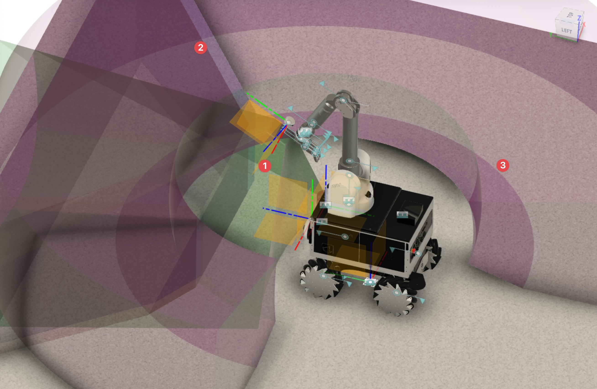

---

# 1. Barrett WAM Specs:
## 1.1 7DOF WAM:
### 1.1.1 Motors (*1):
|      | 1-4  | 5-6  | 7    | BHand | Units |
| ---- | ---- | ---- | ---- | ----- | ----- |
| Design Voltage | 48 | 48 | 48 | 19.8 | V |
| Back EMF | 0.457 | 0.236 | 0.067 | 0.0177 | V/rad/sec |
| No Load Speed | 100.218 | 192.309 | 569.022 | 1070 | rad/s|
| Max Continuous Torque | 1.490 | 0.356 | 0.091 | 0.0367 | Nm |
| Torque Constant | 0.457 | 0.236 | 0.067 | 0.0177 | Nm/A |
| Inductance | 4.068 | 3.918 | 2.035 | 1.14 | mH |
| Resistance | 3.473 | 6.213 | 5.205 | 4.95 | Ohms |
| Rotor Inertia | 9.293E-5 | 1.472E-5 | 1.349E-6 | 1.41E-7 | kg*m2 |
| Viscous Friction | 7.549E-5 | 8.899E-6 | 1.259E-6 | 0.674E-3 | Nm/rpm |

### 1.1.2 Power (*1):
Status | Control | 4-DOF | 7-DOF
-- | -- | -- | --
Powered on, no torques | External | 18 W | 27 W
Active at home position | External | 30 W | 40 W
Active at worst-case** position, 4kg payload | External | 65 W | XXX
Active at worst-case** position, 3kg payload | External | XXX | 80 W
Active at worst-case** position, 3kg payload | Internal | XXX | 85 W
Active at worst-case** position with BH8-280, 2kg payload | Internal | XXX | 120 W
Peak | External | 600 W | 800 W

### 1.1.3 Drive Inertias (*6)
Motor Drive Number | Total Drive Inertia at Rotor (kg-m2) |Drive Ratios | Total Reflected Inertia at Output (kg-m2) 
-- | -- | -- | --
M1 | 0.00011631 |42.00 |0.205190
M2 | 0.00011831 |28.25 |0.094428 
M3 | 0.00011831 |28.25 |0.094428 
M4 | 0.00010686 |18.00 |0.034628 
M5 | 0.00001685 |9.48  |0.001584 
M6 | 0.00001745 |9.48  |0.001641 
M7 | 0.00000142 |14.93 |0.000318

### 1.1.4 Puck communication (*7)
Frequency: 500 Hz (2 ms)
Nescessary in-case one attempts to perform PID gain tuning.

## 1.2 Barrett Torque Sensor (*2):
| Property | Value |
| --- | --- |
| Total Mass | 136 g |
| Dimensions | Diameter | 90 mm |
| | Height | 12 mm |
| Sensing Range | Fx, Fy : ‡ 80 N |
| | Fz     : ‡ 135 N |
| | Tx, Ty : ‡ 2.75 N-m |
| | Tz     : ‡ 2.75 N-m |
| Sensing Resolution | Fx, Fy : 50 mN |
| | Fz     : 80 mN |
| | Tx, Ty : 1.5 mN-m |
| | Tz     : 1.5 mN-m |
| Single-Axis Overload | Fx, Fy : 3000 N |
| | Fz     : 3600 N |
| | Tx, Ty : 60 N-m |
| | Tz     : 100 N-m |
| Power | 48 V  1.7 W |
| Characteristics | Output: 12 bits |
| | Noise: 2 bits (without filtering) |
| | Rate: 2.5 kHz max |
| | Hysteresis: <5% |

## 1.3 Barrett Hand (*3):
| Property | Value |
| --- | --- |
| Kinematics | Total fingers: 3 |
| | Fingers which spread: 2 |
| | Joints per finger: 2 |
| | Motors per finger: 1 |
| | Axes of palm spread motion: 2 |
| | Motors for palm spread motion: 1 |
| | Total hand axes: 8 |
| | Total hand motors: 4 |
| Range of Motion | Finger base joint: 140° |
| | Fingertip: 45° |
| | Finger spread: 180° |
| Speed | Finger fully open to fully closed:1.0 sec |
| | Full 180° finger spread: 0.5 sec |
| Sensing Resolution | 12-bit absolute sensing at each motor with array of Hall sensors |
| Force | Weight Hand: 980 grams |
| | Payload 6.0 kg |
| | Finger Forces (at tip) Active: 15 N |
| | Passive: 20 N |
| Properties | - Rare-Earth brushless-DC servo motors |
| | - Worm drives integrated with proprietary |
| | cable drive and breakaway clutch |
| | DC Operation 20-80 VDC |
| | 5/12/250 W idle/typ/max |
| | AC Operation single-phase, 85-260 VAC, 50/60 Hz |
| | 10/20/300 W idle/typ/max |
| | Single Cable to Hand 5mx5mm flexible cable |
| | Dimensions: See Diagram (base is only 25mm tall) |
| Video: | [https://www.youtube.com/watch?v=aDvykgDyEg8](https://www.youtube.com/watch?v=aDvykgDyEg8) |

---
*1. [ref: motor power](https://support.barrett.com/wiki/WAM/Specifications%3AMotorsMaterialsPower)

*2. [ref: TS sensor](https://web.barrett.com/files/Low-Profile_Force-Torque_Sensor_FT-02-2011.pdf)

*3. [ref: BHand Spec](https://support.barrett.com/wiki/Hand/280/KinematicsJointRangesConversionFactors)

*4. Spec: [WAM_UsersGuide_AE-00.pdf](http://www.me.unm.edu/~starr/research/WAM_UsersGuide_AE-00.pdf)

*5. Review Paper Ref: [328784157_Light_Weight_Robot_Arms-An_overview#pf3](https://www.researchgate.net/publication/328784157_Light_Weight_Robot_Arms-An_overview#pf3)

*6. [WAM Inertial Spec](https://web.barrett.com/support/WAM_Documentation/WAM_InertialSpecifications_AC-02.pdf)

*7. [WAM Puck communication](https://support.barrett.com/wiki/WAM/DetailedSystemOperation#SoftwareArchitecture)

# 2. Power Table

## 2.1 Battery Status

### 2.1.1 LiFePo (40152S 15Ah) [Original Robotnik]

- [Ref of Discharging Chart](https://footprinthero.com/lifepo4-battery-voltage-charts)

- [datasheet](https://www.servovision.com/Battery/Life/Life/headway%2040152S%20specifications%2015Ah.pdf) https://www.lifepo4-battery.com/Products/Cylindrical-battery-cell/Headway-40152S-15Ah.html 

  -  Lifecycle: 2000Cycles.

- | Cell      | Max Current | Const Voltage | Capacity | Temperature | Nominal Voltage | Discharge <br />(fast cont/max pulse) | Cutoff | BMS Cutoff |
  | --------- | ----------- | ------------- | -------- | ----------- | --------------- | ------------------------------------- | ------ | ---------- |
  | 1         | 2C（30A)    | 3.6~3.7 V     | 15 Ah    | -20~60 C    | 3.2 V           | 45A /150A                             | 2.0 V  | -          |
  | 16 series | 2C（30A)    | 57.6 V        | 15 Ah    | -20~60 C    | 51.2 V          | 45A /150A                             | 32 V   | ?? 48V?    |

### 2.1.2 LiPo (18650) [Candidate]

- [Ref of Discharging Chart](https://goldenmotor.com/SMF/index.php?topic=7116.0)

- [Ref of Charging Stage Chart 18650 DigiKey](https://www.digikey.com/en/maker/blogs/charging-lithium-ion-batteries)

  - > The [18650 ](http://www.powerstream.com/p/LG-ICR18650HE2-REV0.pdf)is popular cylindrical lithium cell, with a capacity of 2500 mAh. The datasheet recommends a 1250 mA constant current charge, then 4.2 V constant voltage charge, and charge termination when the current drops to **50 mA**. The datasheet specifies a fast charge, which is 4000 mA constant current, then 4.2 V constant voltage, then cut off at 100 mA, which is a C/25 charge termination.

- | Cell       | Const Current | Const Voltage | Capacity | Temperature                             | Nominal Voltage | Discharge Continuous<br />(std/fast/max) | Cutoff | BMS Cutoff |
  | ---------- | ------------- | ------------- | -------- | --------------------------------------- | --------------- | ---------------------------------------- | ------ | ---------- |
  | 1          | 1~1.25 A      | 4.2 V         | 2.5 Ah   | 0~50 C Charging<br />-20~75 C Discharge | 3.6 V           | 0.5A / 10A / 20A                         | 2.5V   | -          |
  | 8 parallel | 8A            | -             | 20Ah     | -                                       | 3.6 V           | 4A / 80A / 160 A                         | -      | -          |
  | 14 series  | -             | 58.8 V        | -        | -                                       | 50.4 V          | -                                        | 35 V   | -          |
  | 52 V       | 8A            | 58.8 V        | 20Ah     | 0~50 C Charging<br />-20~75 C Discharge | 50.4 V          | 4A / 80A / 160 A                         | 35 V   | 42 V       |

- > :notebook: From the chart, the V_float = 54.4V would work during stage 3
  >
  > :notebook: From the table, the V_const_max = 58.8V > 57.6V Const Voltage Charging
  >
  > 📓 From the table, the I_const_max = 8A > 6.25A Boost Const Current

### 2.1.3 Original Charger for Lithium Battery 

- [Model: PB-360P-48](https://www.meanwell.com/productPdf.aspx?i=24#1)

- | Boost Charging V | Float Charging V | Capacity | Output Current | Over Volt Protection | Efficiency |
  | ---------------- | ---------------- | -------- | -------------- | -------------------- | ---------- |
  | 57.6 V           | 54.4 V           | 20~65 Ah | 6.25 A         | 59~64 V              | 87%        |

### 2.1.4 Comparison Table (online)

|      | Discharging Table                                            | Charging Stages                                              |
| ---- | ------------------------------------------------------------ | ------------------------------------------------------------ |
| 48V  | [Ref of Discharging Chart](https://footprinthero.com/lifepo4-battery-voltage-charts)<br />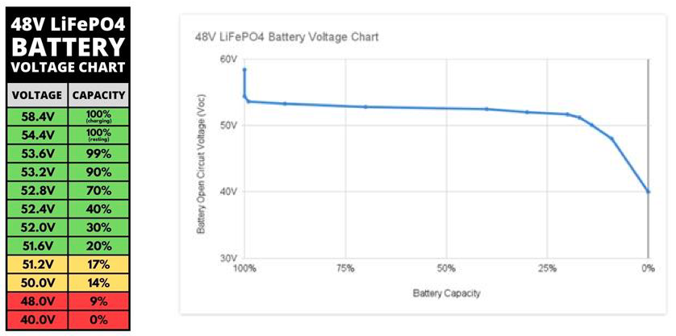 | [Model: PB-360P-48](https://www.meanwell.com/productPdf.aspx?i=24#1)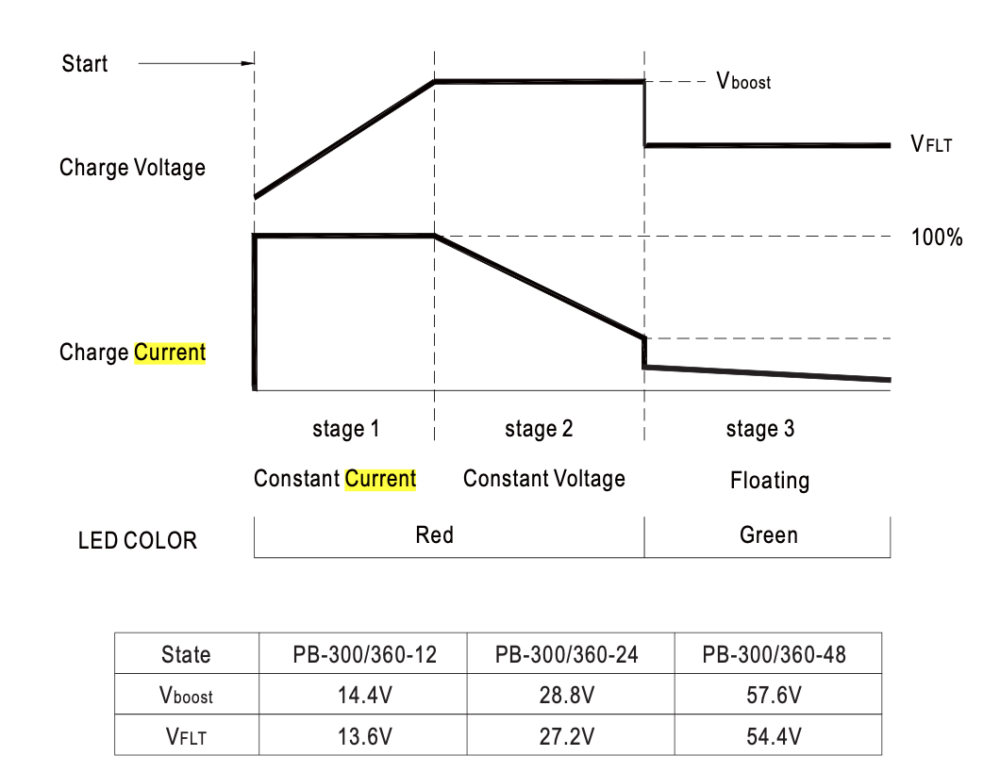<br /> |
| 52V  | [Ref of Discharging Chart](https://goldenmotor.com/SMF/index.php?topic=7116.0)<br /> | [Ref of Charging Stage Chart 18650 DigiKey](https://www.digikey.com/en/maker/blogs/charging-lithium-ion-batteries)<br />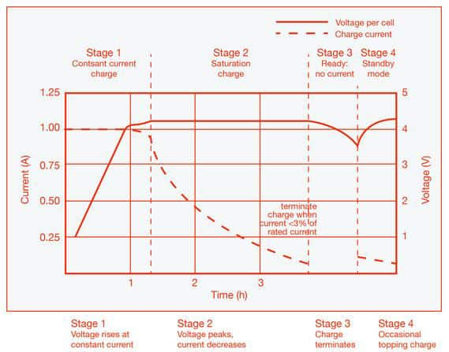 |


### 2.1.5 Comparison Table (Actual Collection)

#### 2.1.5.a) Discharge vs Charging with Summit:

|      | Discharge with Summit ON Only                                | Charge with Summit ON Only                                   |
| ---- | ------------------------------------------------------------ | ------------------------------------------------------------ |
| 48V  | 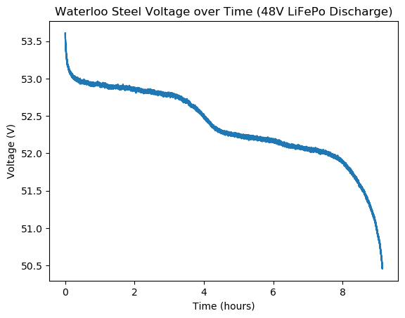              | 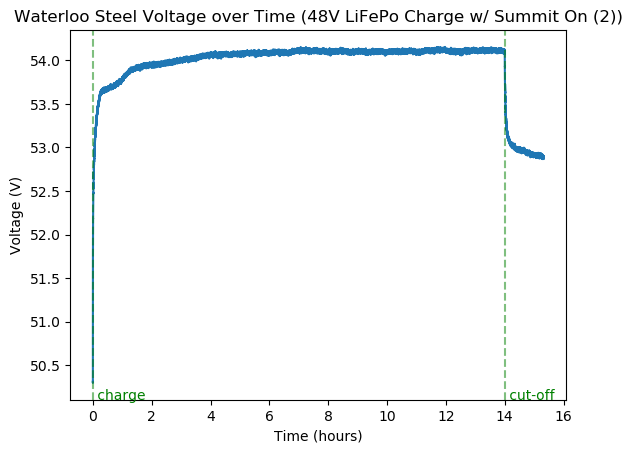 |
| 52V  | 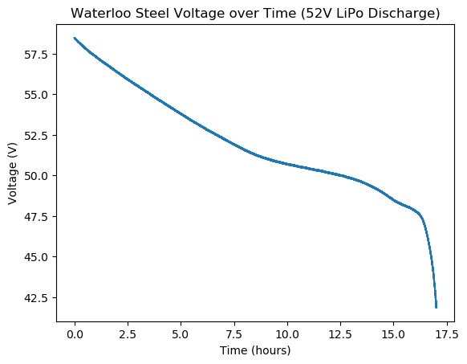 | 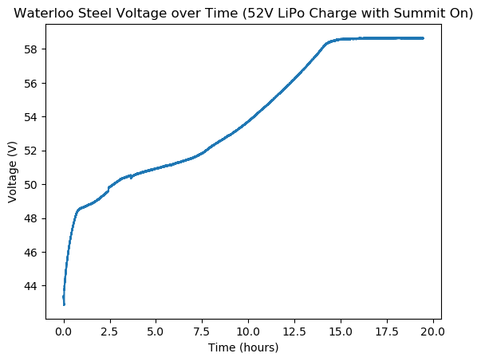 |

#### 2.1.5.b) Discharge with Summit and WAM:

|      | Discharge with Demo Programs                                 | Discharge with Summit ON and WAM_node Op.                    |
| ---- | ------------------------------------------------------------ | ------------------------------------------------------------ |
| 48V  | 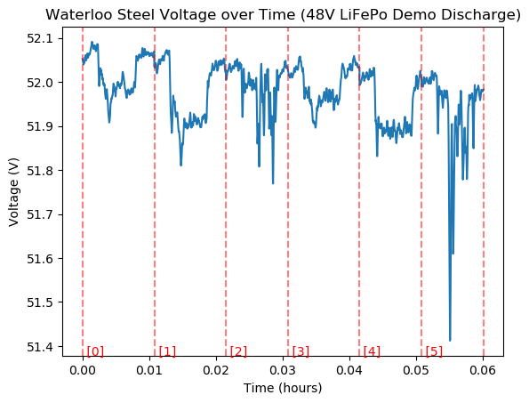<br />- [5] Joystick interfere to avoid collision.<br />- [2] [5] : demo 14 , moving fwd, wam pointing fwd<br />- [0] [3] : demo 12 , spinning, wam swinging up and down<br />- [1] : demo 13, going circles, wam swinging up and down |                                                              |
| 52V  |                                                              | 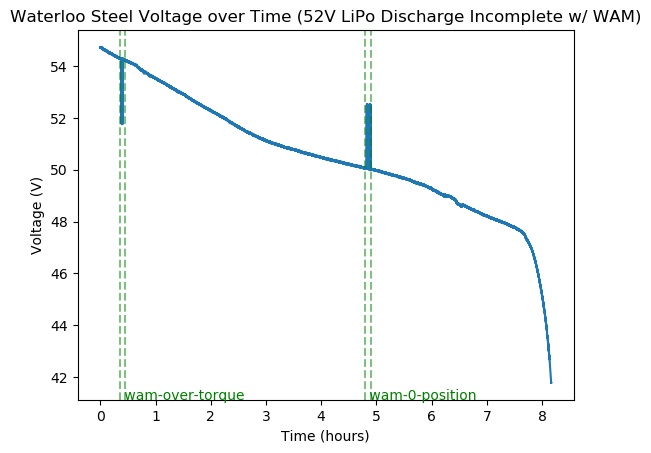 |


## 2.2 WAM Voltage

- The standard WAM system requires **an input voltage of 18-90VDC**
- **7-DOF ---> Q(no torque): 27W Typ(2kg payload): 45W Peak: 800W**
- Provided WAM Standalone Power Supply switches automatically to local voltage standards (100-120 & 200-240 VAC at 50-60Hz)
  - **Output: 10A of direct current at 48V.** 
- The safety module is configured with respect to 48V

### 2.2.1 WAM Voltage Safty Module

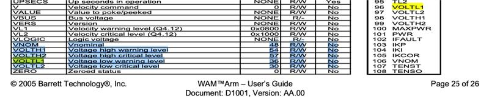

- From safety manual [WAM_UserManual_AH-00.pdf] at pg. 29/80 (4.5.2 Safety Board):

```bash
a. SET SAFE 4 (this is necessary; do not skip this step)
b. SET SAFE 5
c. FIND VBUS
d. SET SAFE 0
e. SET VOLTL1 36
f. SET VOLTL2 30
g. SET VOLTH1 54
h. SET VOLTH2 57
i. SET GRPA 1
j. SET GRPB 2
k. SET GRPC 3
l. SAVE
m. RESET
o. GET VOLTL2 (should be 30, else SET and SAVE it again)
p. GET VOLTH1 (should be 54, else SET and SAVE it again)
q. GET VOLTH2 (should be 57, else SET and SAVE it again)
r. GET GRPA (should be 1, else SET and SAVE it again)
s. GET GRPB (should be 2, else SET and SAVE it again)
t. GET GRPC (should be 3, else SET and SAVE it again)
```

## 2.3 Other Components Voltage Ranges:

| Item Category      | Model          | Voltage   | Rated            | Peak       | Link                                                        |
| ------------------ | -------------- | --------- | ---------------- | ---------- | ----------------------------------------------------------- |
|Solid State Relays|Crydom D1D60|1-72VDC|60A|180A|[datasheet](https://www.mouser.ca/datasheet/2/657/sensata_1_dc_series_panel_mount_datasheet-2933622.pdf)|
|Motor Driver|DZCANTE-040L80|10-80VDC|20A|40A|[datasheet](https://www.a-m-c.com/product/dzcante-040l080/)|
|Switch|Omron A16S-2N-2L||||[datasheet](https://octopart.com/datasheet/a16s-2n-2l-omron-1412927)|
|Switch|Omron A16-2||||[datasheet](https://octopart.com/datasheet/a16s-2n-2l-omron-1412927)|
|Power Relay|Finder 40.52.7.048.0000|5-115VDC|8A|15A|[datasheet](https://us.rs-online.com/m/d/c29b7ebd007f39dcfba28a257273bea3.pdf)|
|DC/DC Converter|URB4805xD-10WR2A2S|||||
|DC/DC Converter|WAF 15048S12W|18-75VDC|12.5A|20A|[datasheet](https://www.pduke.com/product_d/126/WAF%28D%29150W%20Datasheet.pdf)|
|Universal Battery Eliminator Circuit|TR-UBEC7.5|8-42V|5A|7.5A|[user manual](https://cdn-global-hk.hobbyking.com/media/file/213694508X973530X2.jpg)|
|Motor|Elifebike QQ-M85F|||||
|Through Bore Encoder|15T-04-SF-1000-NC-HV-5V-G2-ST-IP50||||[datasheet](https://encoder.co.uk/core/files/encoder/products/ce7f311ea263465cd07a37663f00eca8.pdf)|
|Sensor|Axis M5013|3V Lithium Ion Battery|||[user manual](https://www.axis.com/dam/public/18/46/1b/axis-m5013--user-manual-en-US-98369.pdf)|
|Sensor|Orbbec Astra|||||
|Sensor|Velodyne LIDAR VLP-16|-15-15VDC|||[user manual](https://velodynelidar.com/wp-content/uploads/2019/12/63-9243-Rev-E-VLP-16-User-Manual.pdf)|
|Sensor|PIXHAWK|2-12S Battery||90A|[user manual](https://download.hkwezhan.cn/contents/sitefiles3604/18021148/files/65499..pdf?response-content-disposition=inline%3Bfilename%3DPIXHAWK%2520User%2520Manual_20210628.pdf&response-content-type=application%2Fpdf&auth_key=1678819622-4bfc376ba5d84acb81077ed4a133b613-0-331139777df317e7ea7018155d5e2bda)|
|Connector|Binder 09-0412-80-04|Rated:125V Peak:1500V|3A|4A|[datasheet](https://www.farnell.com/datasheets/576764.pdf?_ga=2.109021762.1726585941.1682346718-1866203147.1678113515&_gac=1.112799094.1678980967.CjwKCAjw_MqgBhAGEiwAnYOAenHc6lZFb8ekd0lZDxP8gacqlufCyj8XWF8MkVtp-4ihlBGIvZF8ARoCuzEQAvD_BwE)|
|Connector|VS-08-BU-RJ45/BU Pheonix contact|150VDC|1.5A||[datasheet](https://www.farnell.com/datasheets/2327249.pdf)|
|Bluetooth Dongle|CSBLUEKEY200|||||
|Switch|Netgear GS108GE|||||
|PC|Mitac PD10BI|8-19VDC via DC Jack|||[datasheet](https://download.mitacmct.com/Files/datasheets/motherboards/PD10BI.pdf)|
||TP-Link AC-1750|12VDC|2.5A||[product specifications](https://www.tp-link.com/ca/home-networking/wifi-router/archer-c7/#specifications)|
|Hardware|WAM|||||
|Computer|MXE-211|3-36VDC|||[datasheet](https://www.adlinktech.com/Products/DownloadMDownload.aspx?lang=en&pdNo=1699&kind=D)|
|Computer|Jetson Orin|7-20VDC|||[developer wiki](https://developer.ridgerun.com/wiki/index.php/NVIDIA_Jetson_Orin/Introduction/Carrier_Boards/NVIDIA_developer_kit)|
|||||||

## 2.4 Power Consumption Table
|Category | Item                 | Power Consumption (W) | Link|
|---------| -------------------- | --------------------- |-----|
|Hardware| WAM (4DOF, Idle)     | 18                    |[User guide](https://uofwaterloo.sharepoint.com/sites/tm-eng-roboticsteamsoojeon/Shared%20Documents/Forms/AllItems.aspx?FolderCTID=0x01200008FB7123DE102640A799461CB7060FB6&id=%2Fsites%2Ftm%2Deng%2Droboticsteamsoojeon%2FShared%20Documents%2FGeneral%2FDocumentations%2FBarrett%20Research%2FWam%20Arm%2FWAM%5FUsersGuide%5FAE%2D00%2Epdf&viewid=1d06a9bc%2Dbf67%2D4953%2Db9b5%2Ddf4aadc83428&parent=%2Fsites%2Ftm%2Deng%2Droboticsteamsoojeon%2FShared%20Documents%2FGeneral%2FDocumentations%2FBarrett%20Research%2FWam%20Arm)|
|Hardware| WAM (7DOF, Idle)     | 27                    |[User guide](https://uofwaterloo.sharepoint.com/sites/tm-eng-roboticsteamsoojeon/Shared%20Documents/Forms/AllItems.aspx?FolderCTID=0x01200008FB7123DE102640A799461CB7060FB6&id=%2Fsites%2Ftm%2Deng%2Droboticsteamsoojeon%2FShared%20Documents%2FGeneral%2FDocumentations%2FBarrett%20Research%2FWam%20Arm%2FWAM%5FUsersGuide%5FAE%2D00%2Epdf&viewid=1d06a9bc%2Dbf67%2D4953%2Db9b5%2Ddf4aadc83428&parent=%2Fsites%2Ftm%2Deng%2Droboticsteamsoojeon%2FShared%20Documents%2FGeneral%2FDocumentations%2FBarrett%20Research%2FWam%20Arm)|
|Hardware| WAM (4DOF, Max)      | 600                   |[User guide](https://uofwaterloo.sharepoint.com/sites/tm-eng-roboticsteamsoojeon/Shared%20Documents/Forms/AllItems.aspx?FolderCTID=0x01200008FB7123DE102640A799461CB7060FB6&id=%2Fsites%2Ftm%2Deng%2Droboticsteamsoojeon%2FShared%20Documents%2FGeneral%2FDocumentations%2FBarrett%20Research%2FWam%20Arm%2FWAM%5FUsersGuide%5FAE%2D00%2Epdf&viewid=1d06a9bc%2Dbf67%2D4953%2Db9b5%2Ddf4aadc83428&parent=%2Fsites%2Ftm%2Deng%2Droboticsteamsoojeon%2FShared%20Documents%2FGeneral%2FDocumentations%2FBarrett%20Research%2FWam%20Arm)|
|Hardware| WAM (7DOF, Max)      | 800                   |[User guide](https://uofwaterloo.sharepoint.com/sites/tm-eng-roboticsteamsoojeon/Shared%20Documents/Forms/AllItems.aspx?FolderCTID=0x01200008FB7123DE102640A799461CB7060FB6&id=%2Fsites%2Ftm%2Deng%2Droboticsteamsoojeon%2FShared%20Documents%2FGeneral%2FDocumentations%2FBarrett%20Research%2FWam%20Arm%2FWAM%5FUsersGuide%5FAE%2D00%2Epdf&viewid=1d06a9bc%2Dbf67%2D4953%2Db9b5%2Ddf4aadc83428&parent=%2Fsites%2Ftm%2Deng%2Droboticsteamsoojeon%2FShared%20Documents%2FGeneral%2FDocumentations%2FBarrett%20Research%2FWam%20Arm)|
|Hardware| Elifebike QQ-M85F                | 250*4 = 1000          |[Circuit diagram](https://uofwaterloo.sharepoint.com/sites/tm-eng-roboticsteamsoojeon/Shared%20Documents/Forms/AllItems.aspx?FolderCTID=0x01200008FB7123DE102640A799461CB7060FB6&id=%2Fsites%2Ftm%2Deng%2Droboticsteamsoojeon%2FShared%20Documents%2FGeneral%2FDocumentations%2FRobotnik%2F171102A%20%2D%20Steel%20%2D%20Waterloo%2Epdf&viewid=1d06a9bc%2Dbf67%2D4953%2Db9b5%2Ddf4aadc83428&parent=%2Fsites%2Ftm%2Deng%2Droboticsteamsoojeon%2FShared%20Documents%2FGeneral%2FDocumentations%2FRobotnik)
|Computer| Jetson Orin          | 60                    |[datasheet](https://www.nvidia.com/content/dam/en-zz/Solutions/gtcf21/jetson-orin/nvidia-jetson-agx-orin-technical-brief.pdf)|
|Router| TP-Link AC-1750      | 18                      |[product specifications](https://www.tp-link.com/ca/home-networking/wifi-router/archer-c7/#specifications)|
|Computer| MXE-211              | 40                    |[product specifications](https://www.tp-link.com/ca/home-networking/wifi-router/archer-c7/#specifications)|
|Sensor| Intel Realsense L515 | 3.3*2 = 6.6             |[datasheet](https://dev.intelrealsense.com/docs/lidar-camera-l515-datasheet)|
|Sensor| Velodyne Lidar VLP-16      | 8                 |[product specifications](https://www.amtechs.co.jp/product/VLP-16-Puck.pdf)|
|Solid State Relays|Crydom D1D60|0.535|[datasheet](https://www.mouser.ca/datasheet/2/657/sensata_1_dc_series_panel_mount_datasheet-2933622.pdf)||
|Motor Driver|DZCANTE-040L80|1520|[product specification](https://www.servo2go.com/dzcante-040l080/)|
|Power Relay|Finder 40.52.7.048.0000|0.3|[datasheet](https://us.rs-online.com/m/d/c29b7ebd007f39dcfba28a257273bea3.pdf)|
|DC/DC Converter|WAF 15048S12W|2.52|[datasheet](https://www.heliosps.com/wp-content/uploads/wpallimport/files/HPS-DCDCONVERTERS-INDUSTRIAL-WAF(D)150W.pdf)|
|Universal Battery Eliminator Circuit|TR-UBEC7.5|0.84|[user manual](https://cdn-global-hk.hobbyking.com/media/file/213694508X973530X2.jpg)|
|Through Bore Encoder|15T-04-SF-1000-NC-HV-5V-G2-ST-IP50|0.5|[datasheet](https://encoder.co.uk/core/files/encoder/products/ce7f311ea263465cd07a37663f00eca8.pdf)|
|Sensor|Orbbec Astra|2.4|[datasheet](https://www.mybotshop.de/Datasheet/Orbbec_Astra_S.pdf)|
|Sensor|PIXHAWK|||
|Switch|Netgear GS108GE|4.92|[product details](https://www.cdw.com/product/netgear-8-port-gigabit-ethernet-switch-plug-and-play-gs108/3507399)|
|Computer|Mitac PD10BI|60|[product specification](https://www.mini-box.com/MITAC-PD10BI-Mini-ITX-Motherboard-DN2800MT)|


## 2.5 DC-DC 48V Regulator For WAM

- We need a DC-DC Regulator for WAM at 48V and 10A or more 

  - (Current Fuse Max at 10A)
  - Rated load at 120 W with 2kg load and BHand
  - Max Peak at 800 W
  - Old: 50V * 10A = 500 W, and never had blown the fuse
  - WAM Software Protection @48V: 54V Warning, 57V Cut-off

  | Item                                                         | Type                                                     | Price                                                        | DCV_i         | V_o                    | I_o_rate | Regulator Topology  | Notes                                                        | Efficiency          |
  | ------------------------------------------------------------ | -------------------------------------------------------- | ------------------------------------------------------------ | ------------- | ---------------------- | -------- | ------------------- | ------------------------------------------------------------ | ------------------- |
  | [Digikey](https://www.digikey.ca/en/products/detail/renesas-electronics-america-inc/ISL81801EVAL2Z/13681268?s=N4IgjCBcoCwBxVAYygMwIYBsDOBTANCAPZQDaIATBQGxgUwgC6hADgC5QgDKbATgJYA7AOYgAvmMIUyIACIBhALQKABADUimNumG4mYoA) - [ISL81801EVAL2Z](https://www.renesas.com/us/en/document/mat/isl81801eval2z-user-manual) | Dev Board                                                | $189.86                                                      | 32~80         | 48V                    | 5A       | Buck-Boost @ 200kHz | UV/OV/OC/OT protection                                       | >95% when  >1A <60V |
  | [Mouser](https://www.mouser.ca/ProductDetail/CUI-Inc/VFK400W-Q48-S48-DIN?qs=WyjlAZoYn52XeugfCMaxmA%3D%3D) - [VFK400W-DIN](https://www.mouser.ca/datasheet/2/670/vfk400w_din-1774615.pdf) | Rail Mount Enclosed                                      | $904.23                                                      | 18~75         | 48V                    | 8.3A     | 250kHz              | UV/OV/OC/OT protection, isolated, heat sink                  | 87%                 |
  | Not-stock [Mouser](https://www.mouser.ca/ProductDetail/CUI-Inc/VFK600-D48-S48-DIN?qs=WyjlAZoYn50L%2FqNpVJj4Cw%3D%3D) - [VFK600-D48-S48-DIN]() | Rail Mount Enclosed                                      | $838.02                                                      | 36~75         | 48V                    | 12.5A    |                     | UV/OV(x1.15-1.4)/OC/OT protection, isolated, heat sink       | 92%                 |
  | **19 in stock [Digikey](https://www.digikey.ca/en/products/detail/cui-inc/VFK600-D48-S48/2770684) - [VFK600-D48-S48](https://www.cui.com/product/resource/vfk600.pdf)** | 7.84" L x 4.99" W x 1.54" H (199.1mm x 126.8mm x 39.1mm) | $714.65                                                      | -             | -                      | -        | -                   | -                                                            | -                   |
  | **153 in stock<br />[Digikey](https://www.digikey.ca/en/products/detail/mean-well-usa-inc/SD-500L-48/7706541) - [SD-500L-48](https://www.meanwellusa.com/upload/pdf/SD-500/SD-500-spec.pdf)** | 8.46" L x 4.53" W x 1.97" H (215.0mm x 115.0mm x 50.0mm) | 239.57<br/>[$**229.45 (Mouser)**](https://www.mouser.ca/ProductDetail/MEAN-WELL/SD-500L-48?qs=umBTOZqEewis66%252Betk6pyQ%3D%3D) | 19~72         | adjustable<br />46~60V | 10.5A    | Isolated DC-DC      | forced air cooling, OV 62~68V, Remote-ON/OFF with 4-10V wire signal | 89%                 |
  | [DDR-480C-48](https://www.meanwell.com/webapp/product/search.aspx?prod=DDR-480#1) [Mouser - 29 in stock](https://www.mouser.ca/ProductDetail/MEAN-WELL/DDR-480C-48?qs=sGAEpiMZZMsc0tfZmXiUnRRWZIj0J6UIre%252Bjcsip6HnCpoeqQekHCw%3D%3D) vs [Digikey](https://www.digikey.ca/en/products/detail/mean-well-usa-inc/DDR-480C-48/12333792) | Isoltated DIN Rail<br /> 129mm x 85.5 mm x 125.2 mm      | 306.86<br/>[**$291.90 (Digikey)**](https://www.digikey.ca/en/products/detail/mean-well-usa-inc/DDR-480C-48/12333792) | 33.6 ~ 67.2 V | adjustable<br />48~56V | 10A      | Isolated DC-DC      | All Protections, Isoltated, Remote ON-OFF, Current Sharing   | 92%                 |
  | **3 in stock<br />RSD-500C-48<br />[Digikey](https://www.digikey.ca/en/products/detail/mean-well-usa-inc/RSD-500C-48/12341363)<br />[Mouser**](https://www.mouser.ca/ProductDetail/MEAN-WELL/RSD-500C-48?qs=7MVldsJ5Uayd3YnjdzDmvg%3D%3D) | 9.33" L x 3.94" W x 1.61" H (237.0mm x 100.0mm x 41.0mm) | 364.57<br/>$**340.56 (Mouser)**                              | 33.6~67.2     | 48V                    | 9.6A     |                     | Isolated                                                     | 93%                 |
  | **13 In Stock** [Digikey](https://www.digikey.ca/en/products/detail/analog-devices-inc/DC2456A/8544124) - [DC2456A](https://www.analog.com/media/en/technical-documentation/data-sheets/ltc3779.pdf) [Dev Board](https://www.analog.com/media/en/technical-documentation/user-guides/dc2456af.pdf) | Dev. Board                                               | **$363.74**<br />**[$348.39 (Mouser)](https://www.mouser.ca/ProductDetail/Analog-Devices/DC2456A?qs=r5DSvlrkXmIarCeA%252BwJ5mw%3D%3D)** | 16V ~ 120V    | 48V                    | 10A      | Buck-Boost @ 200kHz | Dev. Board                                                   | 98.7%               |
  |                                                              |                                                          |                                                              |               |                        |          |                     |                                                              |                     |

  

# 3. Sensors

## 3.1 L515 Sensor

- Allan Variance Based on 3 Hour Idling Camera IMU

```bash
$ rosrun allan_variance_ros analysis.py --data data/allan_variance.csv
ACCELEROMETER:
X Velocity Random Walk:  0.00137 m/s/sqrt(s)  0.08200 m/s/sqrt(hr)
Y Velocity Random Walk:  0.00179 m/s/sqrt(s)  0.10751 m/s/sqrt(hr)
Z Velocity Random Walk:  0.00200 m/s/sqrt(s)  0.11988 m/s/sqrt(hr)
X Bias Instability:  0.00030 m/s^2  3869.16005 m/hr^2
Y Bias Instability:  0.00055 m/s^2  7163.72035 m/hr^2
Z Bias Instability:  0.00030 m/s^2  3869.13542 m/hr^2
X Accel Random Walk:  0.00004 m/s^2/sqrt(s)
Y Accel Random Walk:  0.00015 m/s^2/sqrt(s)
Z Accel Random Walk:  0.00009 m/s^2/sqrt(s)
GYROSCOPE:
X Angle Random Walk:  0.00863 deg/sqrt(s)  0.51793 deg/sqrt(hr)
Y Angle Random Walk:  0.00611 deg/sqrt(s)  0.36681 deg/sqrt(hr)
Z Angle Random Walk:  0.00460 deg/sqrt(s)  0.27610 deg/sqrt(hr)
X Bias Instability:  0.00161 deg/s  5.79476 deg/hr
Y Bias Instability:  0.00111 deg/s  3.99853 deg/hr
Z Bias Instability:  0.00037 deg/s  1.33671 deg/hr
X Rate Random Walk:  0.00041 deg/s/sqrt(s)
Y Rate Random Walk:  0.00027 deg/s/sqrt(s)
Z Rate Random Walk:  0.00007 deg/s/sqrt(s)
Writing Kalibr imu.yaml file.
Make sure to update rostopic and rate.
```


<eof>

---
[*> Back To Top <*](#Table-of-Contents)
</eof>